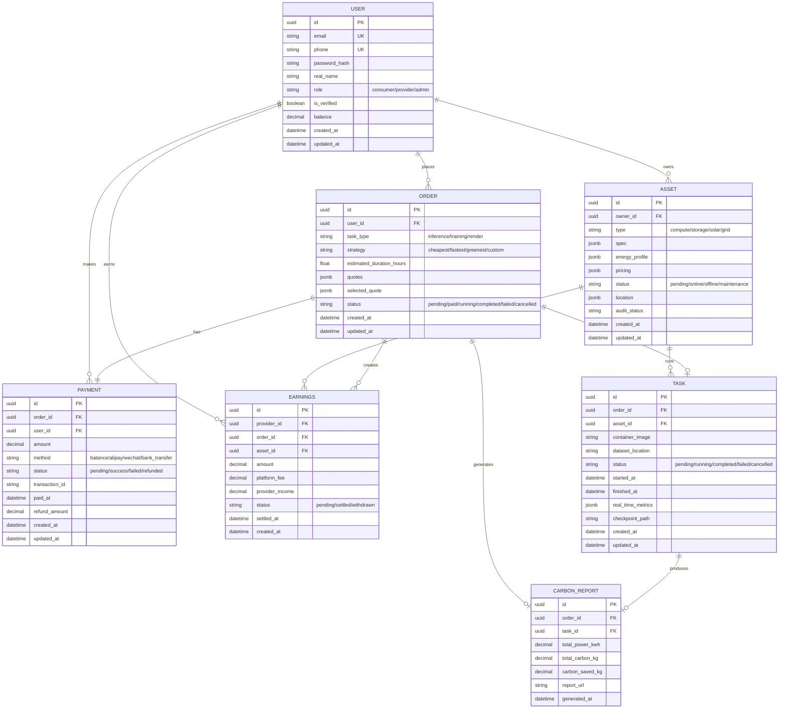
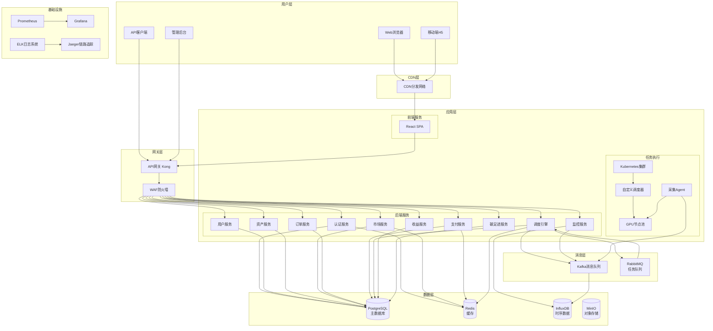

# 算电协同产业互联网平台 Phase 1 产品需求文档(PRD)

**文档版本**：V2.0  
**创建日期**：2026-05-11  
**更新日期**：2026-05-11  
**产品名称**：算电协同工作台  
**文档状态**：待评审  
**产品负责人**：许清楚（Xu）  
**架构师**：高见远（Gao）

---

## 目录

1. [产品目标与范围](#一产品目标与范围)
2. [用户分析与用户故事](#二用户分析与用户故事)
3. [功能需求列表](#三功能需求列表)
4. [非功能需求](#四非功能需求)
5. [UIUX设计建议](#五uiux设计建议)
6. [待确认问题](#六待确认问题)
7. [数据模型](#七数据模型)
8. [技术方案](#八技术方案)
9. [测试方案](#九测试方案)
10. [运营方案](#十运营方案)
11. [项目计划](#十一项目计划)
12. [修订历史](#十二修订历史)

---

## 一、产品目标与范围

### 1.1 产品愿景

打造全球领先的**算电协同产业互联网平台**，通过电力价格信号智能调度算力交易，实现：
- **对算力消费者**：提供最经济、最绿色的算力获取方式
- **对能源提供者**：将闲置算力和能源资产货币化，提升资产收益率
- **对产业**：推动绿色算力发展，助力碳中和目标实现

### 1.2 产品定位

**算电协同工作台** —— 统一的资源交易与调度面板，将抽象的"电力"和"算力"打包成用户可感知、可下单的具体商品，实现算电资源的优化配置。

### 1.3 Phase 1 目标

**核心目标**：用最短路径跑通"算电协同"商业闭环，证明"通过电力价格信号调度算力交易"的单位经济模型可行。

**Phase 1 关键交付成果**：
1. ✅ 支持算力消费者完成"选购算力+优化电费"的完整流程
2. ✅ 支持算力/能源提供者完成资产接入和收益监控
3. ✅ 实现5种核心商品的市场化交易（标准算力、竞价算力、Token套餐、绿电套餐、储能租赁）
4. ✅ 完成至少1个真实场景的端到端闭环验证（如AI模型推理任务）

### 1.4 成功指标（KPI）

| 指标类别 | 具体指标 | Phase 1 目标值 |
|----------|----------|----------------|
| **用户增长** | 注册用户数（算力消费者） | 50+ |
| | 注册提供者数（IDC/储能业主） | 10+ |
| **交易规模** | 月交易量（GPU卡时） | 10,000+ 卡时 |
| | 月交易金额 | ¥100,000+ |
| **产品核心** | 算电协同订单占比 | 30%+ |
| | 平均成本节省率（vs传统云） | 40%+ |
| **用户满意度** | NPS得分 | 40+ |
| | 任务完成成功率 | 95%+ |
| **绿色指标** | 绿电使用占比 | 25%+ |
| | 碳减排量 | 10吨CO₂e/月 |

### 1.5 范围边界

**Phase 1 包含**：
- ✅ 核心交易市场（5种商品类型）
- ✅ 智能调度工作台（任务提交、策略选择、自动报价）
- ✅ 资产注册与管理（算力+能源）
- ✅ 订单管理与支付结算
- ✅ 实时监控与碳足迹报告

**Phase 2 及以后（不包含在Phase 1）**：
- ❌ 多租户企业管理系统
- ❌ 复杂的金融衍生品（算力期货、期权）
- ❌ 跨云厂商的算力迁移
- ❌ 边缘计算节点接入
- ❌ 区块链溯源与Token经济

---

## 二、用户分析与用户故事

### 2.1 用户角色分析

#### 角色1：算力消费者（Compute Consumer）

| 属性 | 说明 |
|------|------|
| **典型用户** | AI开发者、渲染工作室、中小企业CTO |
| **核心痛点** | 1. GPU算力成本高昂<br>2. 不清楚何时、何地算力最便宜<br>3. 绿电算力难获取，ESG合规压力大 |
| **使用场景** | - 离线批量推理任务<br>- AI模型训练<br>- 视频渲染<br>- 科学计算 |
| **决策因素** | 价格 > 可用性 > 绿色属性 > 品牌 |
| **核心价值** | 在一个界面完成"买算力+省电费" |

#### 角色2：算力/能源提供者（Resource Provider）

| 属性 | 说明 |
|------|------|
| **典型用户** | 小型IDC运营商、储能业主、分布式数据中心 |
| **核心痛点** | 1. 资产闲置率高（GPU利用率<40%）<br>2. 储能系统收益模式单一<br>3. 缺乏直接对接算力消费者的渠道 |
| **使用场景** | - 接入闲置GPU算力<br>- 提供储能容量租赁<br>- 监控资产收益<br>- 调整定价策略 |
| **决策因素** | 收益率 > 接入成本 > 结算周期 > 技术支持 |
| **核心价值** | 资产接入即变现，收益透明可期 |

#### 角色3：平台运营者（Platform Operator）

| 属性 | 说明 |
|------|------|
| **典型用户** | 平台运营团队、客服、财务 |
| **核心痛点** | 1. 需要监控平台交易健康度<br>2. 处理用户纠纷和退款<br>3. 优化调度算法和定价策略 |
| **使用场景** | - 监控平台关键指标<br>- 处理异常订单<br>- 调整商品上下架<br>- 生成运营报告 |

---

### 2.2 用户故事（User Stories）

#### P0（Phase 1 必须实现）

**算力消费者**：

| ID | 用户故事 | 验收标准 |
|----|----------|----------|
| US-001 | 作为一名AI开发者，我希望能够浏览可用的算力实例，以便选择合适的算力资源 | - 显示算力列表（GPU型号、价格、可用区、库存）<br>- 支持按价格、性能、绿电比例筛选<br>- 显示实时库存状态 |
| US-002 | 作为一名成本敏感的开发者，我希望选择"竞价算力实例"，以便在可容忍中断的前提下大幅降低成本 | - 明确展示中断风险和中断率<br>- 价格实时变动提醒<br>- 任务被中断后的自动保存点机制 |
| US-003 | 作为一名离线任务用户，我希望提交批量推理任务并选择"极致省钱"策略，以便系统自动匹配最便宜的算电组合 | - 支持上传容器镜像和数据集<br>- 提供多种调度策略（省钱/快速/绿色）<br>- 系统自动生成报价方案 |
| US-004 | 作为一名注重ESG的开发者，我希望筛选"100%光伏供电"的算力，以便我的任务使用绿色能源 | - 商品列表显示绿电标签<br>- 支持按能源类型筛选（光伏/风电/储能）<br>- 任务完成后生成碳足迹报告 |
| US-005 | 作为一名用户，我希望能够预付费下单并实时查看订单状态，以便控制预算和掌握任务进度 | - 支持预付费模式<br>- 订单状态实时更新<br>- 费用明细透明展示 |

**算力/能源提供者**：

| ID | 用户故事 | 验收标准 |
|----|----------|----------|
| US-006 | 作为一名IDC运营商，我希望注册我的GPU算力资源，以便开始接单赚钱 | - 提供资产注册表单（GPU型号、数量、位置、电价）<br>- 支持批量导入<br>- 注册后需平台审核（P1实现自动审核） |
| US-007 | 作为一名储能业主，我希望将我的储能容量作为"电量保障服务"出租，以便获得稳定租金收入 | - 注册储能资产（容量、功率、SOC）<br>- 设置租赁价格和可用时段<br>- 实时查看租赁状态 |
| US-008 | 作为一名提供者，我希望实时查看我的资产收益情况，以便优化定价和运营策略 | - 显示实时收入（元/小时）<br>- 展示历史收益曲线<br>- 支持按资产/时间段筛选 |

#### P1（Phase 1 应包含，可接受部分简化）

| ID | 用户故事 | 验收标准 |
|----|----------|----------|
| US-009 | 作为一名开发者，我希望购买Token套餐包，以便直接调用模型API而无需管理算力基础设施 | - 支持按模型选择套餐（Llama-3-70B等）<br>- 按Token用量计费<br>- 提供API Key管理 |
| US-010 | 作为一名用户，我希望查看我的历史订单和账单，以便进行财务对账 | - 订单列表支持按时间/状态筛选<br>- 显示每笔订单的详细账单<br>- 支持导出CSV |
| US-011 | 作为一名提供者，我希望设置算力的可用时段和价格策略，以便在电价低谷时自动降价吸引任务 | - 支持分时段定价<br>- 支持自动跟随电价调整价格<br>- 提供定价建议（基于历史数据） |
| US-012 | 作为一名用户，我希望在任务执行过程中实时查看功耗和碳排放，以便监控任务的健康度和绿色性 | - 实时显示功率曲线<br>- 显示累计耗电量<br>- 实时计算碳排放量 |

#### P2（Phase 1 可延后，Phase 2 实现）

| ID | 用户故事 | 验收标准 |
|----|----------|----------|
| US-013 | 作为一名企业用户，我希望使用我的企业账户进行批量采购和统一结算，以便简化财务管理 | - 支持企业认证<br>- 支持批量下单<br>- 提供企业账单和发票 |
| US-014 | 作为一名高级用户，我希望通过API自动化提交任务和查询价格，以便集成到我的CI/CD流程 | - 提供RESTful API<br>- 提供SDK（Python/Java）<br>- API文档和示例 |
| US-015 | 作为一名提供者，我希望加入平台的"优质供应商计划"，以便获得更多曝光和更高单价 | - 提供SLA保障选项<br>- 优质供应商标签<br>- 优先匹配高价任务 |

---

## 三、功能需求列表

### 3.1 功能模块划分

```
算电协同工作台
├── M1. 统一资源地图（Marketplace）
├── M2. 协同交易市场（Trading）
├── M3. 智能调度工作台（Scheduling）
├── M4. 资产监控与收益中心（Asset Management）
├── M5. 统一资源注册页面（Resource Registration）
├── M6. 订单管理与支付（Order & Payment）
└── M7. 用户中心（User Center）
```

---

### 3.2 功能详细描述

#### M1. 统一资源地图（Marketplace）

**功能描述**：用户浏览和搜索可用算力/能源资源的统一入口，支持多维度筛选和对比。

| 功能点 | 优先级 | 详细描述 |
|--------|--------|----------|
| F-101 资源列表展示 | P0 | - 卡片式展示所有可用资源<br>- 每个卡片包含：名称、GPU型号、价格、可用区、库存、绿电比例<br>- 支持分页和无限滚动 |
| F-102 多维度筛选 | P0 | - 算力维度：GPU型号、显存大小、卡数<br>- 价格维度：价格区间、计费模式（按时/包月/竞价）<br>- 能源维度：绿电类型（光伏/风电/储能）、PUE值<br>- 地理位置：可用区、城市、国家 |
| F-103 资源详情页 | P0 | - 详细规格参数（GPU性能、网络带宽、存储）<br>- 能源配置文件（电力来源、碳足迹、PUE）<br>- 价格历史曲线<br>- 用户评价和SLA记录 |
| F-104 资源对比 | P1 | - 支持最多3个资源并行对比<br>- 对比维度：价格、性能、绿色指标、SLA |
| F-105 收藏与关注 | P2 | - 收藏常用资源<br>- 关注价格变动提醒 |

---

#### M2. 协同交易市场（Trading）

**功能描述**：核心交易引擎，将"算力"和"能源"打包成可交易商品。

| 功能点 | 优先级 | 详细描述 |
|--------|--------|----------|
| F-201 标准算力实例 | P0 | - 固定价格、高可用SLA（99.9%在线）<br>- 示例：A100-80G，¥15/小时<br>- 支持按小时/包月计费<br>- 不支持中断 |
| F-202 竞价算力实例 | P0 | - 动态价格、可被中断<br>- 示例：A100-80G，¥3/小时（70% OFF）<br>- 显示中断率（低/中/高）<br>- 任务被中断后自动保存 checkpoint |
| F-203 Token套餐包 | P1 | - 按模型推理量计费<br>- 示例：Llama-3-70B，¥0.5/百万Tokens<br>- 支持预付费套餐包（如100万Tokens）<br>- 提供HTTP API接口 |
| F-204 绿电储能算力套餐 | P0 | - "算力+指定来源电力"捆绑<br>- 示例：100%光伏供电，仅凌晨2-6点可用<br>- 显示绿色标签和预计碳减排量<br>- 价格低于标准实例 |
| F-205 储能容量租赁 | P1 | - 电量保障服务<br>- 示例：租赁100kWh储能容量，¥80/天<br>- 保障高价值任务不因电网波动中断<br>- 显示最大功率和可用时长 |
| F-206 购物车与结算 | P0 | - 支持多个资源加入购物车<br>- 结算前生成费用估算<br>- 支持多种支付方式（余额/支付宝/微信/银行转账） |

---

#### M3. 智能调度工作台（Scheduling）

**功能描述**：用户提交计算任务，系统根据策略自动匹配最优算电组合并生成报价。

| 功能点 | 优先级 | 详细描述 |
|--------|--------|----------|
| F-301 任务提交 | P0 | - 支持上传容器镜像（Docker）<br>- 支持上传数据集（或指定数据源位置）<br>- 指定任务类型（推理/训练/渲染）<br>- 预估任务时长 |
| F-302 调度策略选择 | P0 | - **极致省钱**：优先匹配低价电力时段+竞价算力<br>- **快速完成**：优先匹配空闲算力，不计成本<br>- **绿色环保**：优先匹配绿电+储能供电<br>- **自定义**：用户手动设置权重（价格/速度/绿色） |
| F-303 智能报价 | P0 | - 系统瞬时生成报价方案<br>- 展示匹配原因（如"匹配夜间谷电+储能富余"）<br>- 显示费用明细（算力成本+电力成本+平台服务费）<br>- 显示预计碳减排量 |
| F-304 订单确认与支付 | P0 | - 用户确认报价后生成预付费订单<br>- 支持余额支付和第三方支付<br>- 支付后系统自动绑定算力和能源资源 |
| F-305 任务监控 | P0 | - 实时显示任务运行状态（等待/运行中/完成/失败）<br>- 实时显示功耗、累计耗电量、碳排放<br>- 支持查看日志和指标（GPU利用率、温度） |
| F-306 任务管理 | P1 | - 支持暂停/恢复任务<br>- 支持任务优先级调整<br>- 支持任务失败后自动重试 |

---

#### M4. 资产监控与收益中心（Asset Management）

**功能描述**：提供者视角的资产管理后台，监控资产状态和收益情况。

| 功能点 | 优先级 | 详细描述 |
|--------|--------|----------|
| F-401 资产总览仪表盘 | P0 | - 显示名下所有资产（GPU节点、储能系统）<br>- 实时显示在线状态、利用率、收益<br>- 支持按资产类型/地理位置筛选 |
| F-402 收益中心 | P0 | - 实时收入显示（元/小时）<br>- 历史收益曲线（今日/本周/本月/自定义）<br>- 收益明细（每笔订单的分成比例和金额）<br>- 支持提现申请（满100元可提现） |
| F-403 资产监控 | P0 | - GPU监控：温度、功耗、利用率、风扇转速<br>- 储能监控：SOC（荷电状态）、充放电功率、健康度<br>- 告警规则：温度超限、SOC过低、离线告警 |
| F-404 订单管理（提供者视角） | P0 | - 查看正在使用自己资产的订单<br>- 查看历史订单和评价<br>- 对异常订单进行申诉 |
| F-405 定价管理 | P1 | - 设置算力单价和最小租赁时长<br>- 设置储能容量租赁价格<br>- 支持分时段定价（跟随电价自动调整） |
| F-406 性能优化建议 | P2 | - 根据历史数据提供资产利用率优化建议<br>- 提供定价策略建议（降价促销/涨价止损） |

---

#### M5. 统一资源注册页面（Resource Registration）

**功能描述**：提供者接入算力/能源资源的统一入口。

| 功能点 | 优先级 | 详细描述 |
|--------|--------|----------|
| F-501 算力资源注册 | P0 | - 表单字段：GPU型号、数量、显存、位置、网络带宽<br>- 电力信息：电价、电力来源（电网/光伏/风电）、PUE<br>- 定价设置：单价、计费模式、是否参与竞价<br>- 支持批量导入（CSV模板） |
| F-502 储能资源注册 | P0 | - 表单字段：容量（kWh）、最大功率（kW）、SOC、位置<br>- 充放电策略：谷电充电/高峰放电/随时可用<br>- 租赁价格设置<br>- 健康度自评（新/良好/需维护） |
| F-503 资源审核 | P0 | - 平台审核流程（自动+人工）<br>- 审核通过后资源自动上架<br>- 审核拒绝后发送原因通知 |
| F-504 注册教程与文档 | P1 | - 提供详细的注册指南<br>- 提供API接入文档（用于自动化注册）<br>- 常见问题解答 |

---

#### M6. 订单管理与支付（Order & Payment）

**功能描述**：订单全生命周期管理，包括支付、结算、退款等。

| 功能点 | 优先级 | 详细描述 |
|--------|--------|----------|
| F-601 订单管理（消费者视角） | P0 | - 订单列表：待支付/运行中/已完成/已取消<br>- 订单详情：资源信息、费用明细、任务日志<br>- 支持订单取消（未开始运行时可取消） |
| F-602 支付系统 | P0 | - 预付费模式：先充值后消费<br>- 支持余额支付、支付宝、微信支付、银行转账<br>- 支付成功后即时到账<br>- 支付失败自动重试 |
| F-603 结算与分账 | P0 | - 任务完成后自动结算<br>- 平台服务费：收取交易额的10%<br>- 提供者收益：实时累计到可提现余额<br>- 结算明细透明可查 |
| F-604 退款管理 | P1 | - 任务被中断（非用户原因）自动退款<br>- 用户申请退款审批流程<br>- 退款原路返回（支付宝/微信/银行卡） |
| F-605 发票管理 | P2 | - 支持申请电子发票<br>- 发票抬头管理<br>- 发票邮寄（纸质发票） |

---

#### M7. 用户中心（User Center）

**功能描述**：用户账号管理、身份认证、消息通知等基础功能。

| 功能点 | 优先级 | 详细描述 |
|--------|--------|----------|
| F-701 用户注册与登录 | P0 | - 支持手机号注册/登录<br>- 支持邮箱注册/登录<br>- 支持企业邮箱注册（自动识别为企业用户） |
| F-702 身份认证 | P0 | - 个人认证：实名认证（姓名+身份证号）<br>- 企业认证：营业执照+对公账户验证<br>- 认证后解锁更高额度（如提现额度） |
| F-703 消息通知 | P0 | - 站内信：订单状态变更、系统公告<br>- 短信通知：支付成功、任务完成、收益到账<br>- 邮件通知：账单、发票、异常告警 |
| F-704 账户安全 | P1 | - 修改密码<br>- 绑定手机号/邮箱<br>- 登录日志查看<br>- 异地登录提醒 |
| F-705 帮助中心 | P1 | - 新手指南<br>- 常见问题（FAQ）<br>- 联系客服（在线聊天/提交工单） |

---

### 3.3 功能优先级汇总

| 优先级 | 功能数量 | 功能列表 |
|--------|----------|----------|
| **P0（必须）** | 15 | F-101, F-102, F-103, F-201, F-202, F-204, F-206, F-301, F-302, F-303, F-304, F-305, F-401, F-402, F-403, F-501, F-502, F-601, F-602, F-603, F-701, F-702, F-703 |
| **P1（重要）** | 10 | F-104, F-203, F-205, F-306, F-404, F-405, F-503, F-604, F-704, F-705 |
| **P2（可选）** | 5 | F-105, F-406, F-504, F-605 |

---

## 四、非功能需求

### 4.1 性能要求

| 指标 | 要求 | 备注 |
|------|------|------|
| **页面加载时间** | < 2秒（首次加载）<br>< 500ms（后续导航） | 使用CDN加速静态资源 |
| **API响应时间** | < 500ms（普通查询）<br>< 2秒（复杂查询如智能报价） | 数据库查询需优化，热点数据缓存 |
| **系统吞吐量** | 支持1000 TPS（交易下单）<br>支持5000 TPS（查询请求） | 需进行压力测试验证 |
| **调度引擎响应** | < 3秒（生成报价方案） | 涉及多维度检索和计算 |
| **实时监控延迟** | < 5秒（功耗/碳排放数据刷新） | 使用WebSocket推送 |
| **数据存储** | 支持10TB级数据存储（3年） | 使用分布式存储，定期归档冷数据 |

---

### 4.2 安全要求

| 类别 | 要求 | 具体措施 |
|------|------|----------|
| **身份认证** | 多因素认证（MFA） | - 手机号+验证码<br>- 邮箱+密码<br>- 可选：Google Authenticator |
| **权限管理** | 基于角色的访问控制（RBAC） | - 消费者角色：只能查看自己的订单<br>- 提供者角色：只能管理自己的资产<br>- 管理员角色：平台管理权限 |
| **数据安全** | 敏感数据加密存储 | - 密码：bcrypt加盐哈希<br>- 身份证号/银行卡号：AES-256加密<br>- HTTPS全程加密传输 |
| **支付安全** | 支付令牌化 | - 不直接存储用户支付信息<br>- 使用支付宝/微信的支付令牌<br>- 防重放攻击（nonce机制） |
| **API安全** | API密钥管理 | - 支持API Key + Secret签名<br>- 限流（防止滥用）<br>- IP白名单（企业用户） |
| **审计日志** | 操作日志不可篡改 | - 记录所有关键操作（登录/支付/下单）<br>- 日志保存3年<br>- 支持导出和审计 |

---

### 4.3 可用性要求

| 指标 | 要求 | 备注 |
|------|------|------|
| **系统可用性** | 99.9%（即每月停机时间 < 43分钟） | - 多可用区部署<br>- 自动故障切换<br>- 定期健康检查 |
| **数据备份** | 每天全量备份 + 每小时增量备份 | - 备份数据异地存储<br>- 支持PITR（时间点恢复） |
| **灾难恢复** | RTO < 4小时，RPO < 1小时 | - 异地容灾中心<br>- 定期演练恢复流程 |
| **监控告警** | 7x24小时监控 | - 监控指标：CPU/内存/磁盘/网络/API响应时间<br>- 告警渠道：短信/邮件/钉钉群<br>- 自动扩容（根据负载） |

---

### 4.4 兼容性要求

| 类别 | 要求 |
|------|------|
| **浏览器** | Chrome 90+, Firefox 88+, Safari 14+, Edge 90+ |
| **移动端** | 响应式设计，支持移动端浏览器访问（不含原生APP） |
| **API** | RESTful API，支持JSON格式，兼容OpenAPI 3.0规范 |
| **集成** | 提供Python SDK、JavaScript SDK |

---

### 4.5 合规性要求

| 类别 | 要求 |
|------|------|
| **数据隐私** | 符合《个人信息保护法》（PIPL）<br>符合GDPR（如有欧盟用户） |
| **财务合规** | 接入支付宝/微信支付需相关资质<br>提供正规发票（电子/纸质） |
| **碳足迹** | 碳减排计算需符合ISO 14064标准<br>提供可审计的碳足迹报告 |
| **服务提供者资质** | IDC许可证（如提供算力租赁）<br>电力业务许可证（如涉及电力交易） |

---

## 五、UI/UX设计建议

### 5.1 核心页面布局建议

#### 5.1.1 全局导航结构

```
+------------------------------------------------------------------+
|  Logo  算电协同工作台    [资源市场] [智能调度] [资产中心] [订单] | [用户名▼] |
+------------------------------------------------------------------+
|                                                                    |
|                      （主内容区域）                                  |
|                                                                    |
+------------------------------------------------------------------+
```

---

#### 5.1.2 页面1：统一资源地图（Marketplace）

```
+------------------------------------------------------------------+
|  Logo  算电协同工作台    [资源市场] [智能调度] [资产中心] [订单]     |
+------------------------------------------------------------------+
| 筛选区：                                                            |
| [GPU型号▼] [价格区间] [绿电类型▼] [可用区▼] [更多筛选▼]   [搜索框🔍] |
+------------------------------------------------------------------+
| 资源列表                                    | 地图视图（可选）       |
| +------------------------------------------+ +------------------+  |
| | [图标] A100-80G 标准实例                   | |                  |  |
| | 价格：¥15.00/h | 可用区A | 库存：8卡      | |   中国地图       |  |
| | 99.9% SLA | PUE 1.2 | 绿电 30%          | |   显示数据中心   |  |
| | [查看详情] [立即购买]                      | |   位置标记       |  |
| +------------------------------------------+ +------------------+  |
| | [图标] A100-80G 竞价实例 (70% OFF)        |                       |
| | 价格：¥3.00/h | 中断率：中 | 库存：15卡  |                       |
| | [查看详情] [立即购买]                      |                       |
| +------------------------------------------+                       |
| | [图标] L40S 绿电储能套餐                   |                       |
| | 价格：¥12.00/h | 光伏+储能 | 时段 02-06  |                       |
| | 预计碳减排：1.2kg/h | [查看详情] [立即购买] |                       |
| +------------------------------------------+                       |
|                                                                    |
|  [< 上一页] [1] [2] [3] ... [下一页 >]                             |
+------------------------------------------------------------------+
```

**设计要点**：
- 卡片式布局，每张卡片信息密度适中
- 绿色标签醒目展示（吸引ESG用户）
- 价格高亮显示（消费者最关心）
- 库存实时更新（避免超卖）

---

#### 5.1.3 页面2：智能调度工作台（Scheduling）

```
+------------------------------------------------------------------+
| 智能调度工作台 - 提交新任务                                         |
+------------------------------------------------------------------+
|                                                                   |
| 步骤1：上传任务                                                     |
| +----------------------------------------------------------------+ |
| | 容器镜像： [选择文件]  my-image:latest                           | |
| | 数据集：     [选择文件]  dataset-1tb.zip                         | |
| | 任务类型：  [推理▼]     预估时长： [5] 小时                       | |
| +----------------------------------------------------------------+ |
|                                                                   |
| 步骤2：选择调度策略                                                |
| +----------------------------------------------------------------+ |
| | (o) 极致省钱 - 自动匹配低价电力时段+竞价算力                     | |
| | ( ) 快速完成 - 优先匹配空闲算力，不计成本                        | |
| | ( ) 绿色环保 - 优先匹配绿电+储能供电                            | |
| | ( ) 自定义   - 手动设置权重                                     | |
| +----------------------------------------------------------------+ |
|                                                                   |
| 步骤3：系统报价（点击"获取报价"后显示）                              |
| +----------------------------------------------------------------+ |
| | 💡 匹配方案：绿电储能算力包（4卡A100，储能+凌晨谷电联合供电）     | |
| |                                                                 | |
| | 价格优势：**¥2.8/卡/小时**（标准价¥15的2折）                    | |
| | 总费用：  5小时预计 **¥56.00**                                 | |
| | 绿色标签："预计碳减排: 1.2kg"                                   | |
| |                                                                 | |
| | [确认下单] [取消]                                               | |
| +----------------------------------------------------------------+ |
|                                                                   |
+------------------------------------------------------------------+
```

**设计要点**：
- 分步骤引导，降低用户认知负荷
- 报价卡片信息层次清晰（价格 > 方案描述 > 绿色标签）
- 提供"重新报价"按钮（价格实时变动）

---

#### 5.1.4 页面3：任务监控面板（Monitoring）

```
+------------------------------------------------------------------+
| 任务监控 - Job-1024                                                |
+------------------------------------------------------------------+
| 任务信息：                                                         |
| 任务ID：Job-1024 | 状态：运行中 | 开始时间：2026-05-11 02:00 | 预计剩余：2小时 |
+------------------------------------------------------------------+
|                                                                    |
| 实时指标：                                                          |
| +------------------------+ +------------------------+              |
| | 实时功率：2.8 kW       | | 累计耗电量：14 kWh      |              |
| | 实时碳排放：1.4 kg CO₂ | | 预计总费用：¥56.00      |              |
| +------------------------+ +------------------------+              |
|                                                                    |
| 功耗曲线（过去1小时）：                                             |
| +----------------------------------------------------------------+ |
| |     kW                                                          | |
| |     3.0 |    *                                                  | |
| |         |   * *                                                 | |
| |     2.5 |  *   *                                                | |
| |         | *     *             *                                  | |
| |     2.0 |*       *           *                                  | |
| |         |         *         *                                    | |
| |     1.5 |          *       *                                    | |
| |          --------------------------------------------------     | |
| |          0  10  20  30  40  50  60 (分钟)                        | |
| +----------------------------------------------------------------+ |
|                                                                    |
| 任务日志：                                                         |
| +----------------------------------------------------------------+ |
| | 2026-05-11 02:00:00 任务启动                                   | |
| | 2026-05-11 02:00:05 绑定GPU节点：node-shx-001                  | |
| | 2026-05-11 02:00:10 绑定储能单元：ess-shx-001                  | |
| | 2026-05-11 02:05:00 开始推理，批次 1/100                       | |
| | ...                                                            | |
| +----------------------------------------------------------------+ |
|                                                                    |
| [暂停任务] [查看详细日志] [下载中间结果]                            |
+------------------------------------------------------------------+
```

**设计要点**：
- 实时数据通过WebSocket推送（每秒刷新）
- 图表使用Chart.js或ECharts
- 日志支持自动滚动和暂停

---

#### 5.1.5 页面4：资产收益中心（Provider Dashboard）

```
+------------------------------------------------------------------+
| 资产收益中心 - 张三的IDC                                           |
+------------------------------------------------------------------+
| 收益概览：                                                         |
| +------------------------+ +------------------------+              |
| | 今日收益：¥328.50     | | 本月收益：¥8,420.00    |              |
| | 实时收入：¥15.00/h    | | 同比增长：+25%         |              |
| +------------------------+ +------------------------+              |
+------------------------------------------------------------------+
|                                                                    |
| 资产列表：                                                         |
| +----------------------------------------------------------------+ |
| | 资产ID      | 类型   | 状态  | 利用率 | 实时收益 | 操作        | |
| |------------|--------|-------|--------|----------|-------------| |
| | node-shx-01| GPU×4 | 运行中| 95%   | ¥15/h   | [详情][编辑]| |
| | node-shx-02| GPU×8 | 空闲  | 0%    | ¥0/h    | [详情][编辑]| |
| | ess-shx-01 | 储能   | 放电  | 60%   | ¥2/h    | [详情][编辑]| |
| +----------------------------------------------------------------+ |
|                                                                    |
| 收益曲线（过去30天）：                                              |
| +----------------------------------------------------------------+ |
| |     ￥                                                           | |
| |   10k |                                           *            | |
| |       |                                        *     *          | |
| |   8k  |                          *           *           *       | |
| |       |              *           *       *           *           | |
| |   6k  |      *           *           *                          | |
| |       |*           *                                              | |
| |   4k  |                                                            | |
| |        ------------------------------------------------------    | |
| |        1   5   10   15   20   25   30 (日期)                       | |
| +----------------------------------------------------------------+ |
|                                                                    |
| [提现申请] [定价管理] [查看明细]                                    |
+------------------------------------------------------------------+
```

**设计要点**：
- 收益数据实时更新（每秒刷新）
- 图表支持时间范围切换（今日/本周/本月/自定义）
- 提供"收益预测"功能（基于历史数据）

---

### 5.2 关键交互流程

#### 5.2.1 完整交易流程（消费者视角）

```
用户登录
   ↓
浏览资源市场（筛选条件）
   ↓
查看资源详情
   ↓
[决策点] 选择"立即购买" 或 "智能调度"
   ↓                            ↓
标准购买                    提交任务 + 选择策略
   ↓                            ↓
确认订单                    系统生成报价
   ↓                            ↓
[支付]                       [确认下单]
   ↓                            ↓
支付成功                     支付成功
   ↓                            ↓
任务开始运行                  系统自动绑定资源
   ↓                            ↓
实时监控                     实时监控
   ↓                            ↓
任务完成                     任务完成
   ↓                            ↓
生成碳足迹报告                生成碳足迹报告
   ↓
[评价] (可选)
```

---

#### 5.2.2 资产接入流程（提供者视角）

```
用户登录（选择"提供者模式"）
   ↓
进入"资源注册"页面
   ↓
[选择资源类型] 算力 / 储能
   ↓                            ↓
填写算力信息                填写储能信息
   ↓                            ↓
设置定价策略                设置租赁价格
   ↓                            ↓
提交审核
   ↓
[审核流程] 自动审核（P1） + 人工抽查
   ↓
审核通过 → 资源自动上架
   ↓
开始接单赚钱
```

---

#### 5.2.3 智能调度流程（系统内部）

```
用户提交任务 + 选择策略
   ↓
调度引擎接收请求
   ↓
[检索步骤1] 检索可用算力资源
   ↓
[检索步骤2] 检索配套能源资源（电价、绿电、储能）
   ↓
[计算步骤] 计算最优组合（价格/速度/绿色权重）
   ↓
[生成报价] 生成报价方案
   ↓
用户确认下单
   ↓
[绑定步骤] 绑定算力和能源资源
   ↓
[下发任务] 下发任务到GPU节点
   ↓
[监控循环] 实时监控任务状态、功耗、碳排放
   ↓
任务完成 → 结算 + 生成报告
```

---

### 5.3 设计系统建议

| 设计元素 | 建议 |
|----------|------|
| **设计风格** | 简洁、专业、科技感（类似AWS/Azure控制台） |
| **主色调** | 科技蓝（#1890FF）+ 绿色（#52C41A，代表绿电） |
| **字体** | 中文：思源黑体/阿里巴巴普惠体<br>英文：Inter/Roboto |
| **图标库** | Ant Design Icons / Font Awesome |
| **组件库** | Ant Design / Element Plus（Vue） |
| **响应式断点** | 移动端：< 768px<br>平板：768px - 1024px<br>桌面：> 1024px |

---

## 六、待确认问题

### 6.1 商业模式相关问题

| ID | 问题 | 影响范围 | 建议方案 |
|----|------|----------|----------|
| Q-001 | **平台服务费比例**：收取交易额的10%是否合理？ | 商业化 | 建议：5-15%区间，根据提供者议价能力动态调整 |
| Q-002 | **预付费 vs 后付费**：Phase 1是否支持后付费（月结）？ | 支付系统 | 建议：Phase 1仅支持预付费，降低坏账风险 |
| Q-003 | **竞价实例的中断补偿**：任务被中断后，是否补偿用户损失？ | 用户体验 | 建议：补偿未使用时间的50%（吸引用户尝试竞价实例） |
| Q-004 | **储能容量租赁的计费单位**：按天计费是否合理？还是按小时更灵活？ | 商品设计 | 建议：同时支持按小时和按天，满足不同场景 |

---

### 6.2 技术实现相关问题

| ID | 问题 | 影响范围 | 建议方案 |
|----|------|----------|----------|
| Q-005 | **调度引擎的响应时间**：3秒内生成报价是否可行？涉及哪些优化手段？ | 性能 | 建议：使用缓存+异步计算，复杂场景可先返回预估价格 |
| Q-006 | **资源绑定的技术实现**：如何确保Pod只消耗指定源头的电力？需要K8s改造吗？ | 技术架构 | 建议：需要K8s调度器扩展（自定义Scheduler Plugin） |
| Q-007 | **碳足迹计算的数据来源**：碳排放因子从哪里获取？实时还是离线计算？ | 数据准确性 | 建议：使用国家发改委发布的区域电网基准线因子（每年更新） |
| Q-008 | **实时监控的数据采集频率**：每秒采集一次功耗数据会不会太大？ | 存储成本 | 建议：高频数据（1分钟）存时序数据库（InfluxDB），低频数据归档 |

---

### 6.3 合规与法律风险问题

| ID | 问题 | 影响范围 | 建议方案 |
|----|------|----------|----------|
| Q-009 | **电力交易的合规性**：平台是否需要电力业务许可证？ | 法律风险 | 建议：咨询能源局，可能需要"增量配电网业务许可证" |
| Q-010 | **算力跨境交易**：是否支持海外用户使用？数据出境是否合规？ | 合规 | 建议：Phase 1仅限中国大陆用户，数据不出境 |
| Q-011 | **碳足迹报告的法律效力**：报告的审计方是谁？是否符合ISO标准？ | 信任度 | 建议：Phase 1提供"参考报告"，Phase 2引入第三方审计 |

---

### 6.4 用户体验相关问题

| ID | 问题 | 影响范围 | 建议方案 |
|----|------|----------|----------|
| Q-012 | **新手引导**：首次使用的用户是否需要引导教程？ | 用户留存 | 建议：提供"快速上手"引导（3步完成首次下单） |
| Q-013 | **移动端支持**：Phase 1是否需要原生APP？还是仅响应式网页？ | 开发成本 | 建议：Phase 1仅响应式网页，Phase 2再开发APP |
| Q-014 | **多语言支持**：是否需要英文界面？ | 国际化 | 建议：Phase 1仅中文，Phase 2增加英文 |

---

### 6.5 数据模型相关问题

| ID | 问题 | 影响范围 | 建议方案 |
|----|------|----------|----------|
| Q-015 | **统一资产模型的扩展字段**：目前的模型是否足够支撑未来5种商品类型？ | 系统扩展性 | 建议：使用JSONB字段存储扩展属性，保持模型灵活性 |
| Q-016 | **订单拆分逻辑**：一个订单拆成"算力订单"和"能源订单"，如何保证事务一致性？ | 数据一致性 | 建议：使用Saga模式（分布式事务），失败时自动回滚 |

---

## 七、数据模型

### 7.1 实体关系图（ER Diagram）

#### 7.1.1 核心实体



#### 7.1.2 实体关系说明

| 关系 | 说明 | 基数 |
|------|------|------|
| User → Asset | 用户拥有多个资产 | 1:N |
| User → Order | 用户可以下多个订单 | 1:N |
| User → Payment | 用户可以有多笔支付记录 | 1:N |
| User → Earnings | 提供者可以有多笔收益记录 | 1:N |
| Asset → Task | 资产可以运行多个任务 | 1:N |
| Asset → Earnings | 资产产生多笔收益 | 1:N |
| Order → Payment | 订单对应一笔支付 | 1:1 |
| Order → Task | 订单包含多个任务 | 1:N |
| Order → CarbonReport | 订单生成一份碳报告 | 1:1 |
| Order → Earnings | 订单产生提供者收益 | 1:N |
| Task → CarbonReport | 任务产出碳排放数据 | 1:1 |

---

### 7.2 数据库表结构

#### 7.2.1 用户表（users）

```sql
CREATE TABLE users (
    id UUID PRIMARY KEY DEFAULT gen_random_uuid(),
    email VARCHAR(255) UNIQUE NOT NULL,
    phone VARCHAR(20) UNIQUE,
    password_hash VARCHAR(255) NOT NULL,
    real_name VARCHAR(100),
    id_card_hash VARCHAR(255),  -- AES-256加密存储
    role VARCHAR(20) NOT NULL DEFAULT 'consumer',  -- consumer/provider/admin
    is_verified BOOLEAN DEFAULT FALSE,
    is_active BOOLEAN DEFAULT TRUE,
    balance DECIMAL(12, 2) DEFAULT 0.00,
    last_login_at TIMESTAMP WITH TIME ZONE,
    created_at TIMESTAMP WITH TIME ZONE DEFAULT NOW(),
    updated_at TIMESTAMP WITH TIME ZONE DEFAULT NOW()
);

-- 索引
CREATE INDEX idx_users_email ON users(email);
CREATE INDEX idx_users_phone ON users(phone);
CREATE INDEX idx_users_role ON users(role);
CREATE INDEX idx_users_created ON users(created_at);

-- 约束
ALTER TABLE users ADD CONSTRAINT chk_role CHECK (role IN ('consumer', 'provider', 'admin'));
ALTER TABLE users ADD CONSTRAINT chk_balance CHECK (balance >= 0);
```

#### 7.2.2 资产表（assets）

```sql
CREATE TABLE assets (
    id UUID PRIMARY KEY DEFAULT gen_random_uuid(),
    owner_id UUID NOT NULL REFERENCES users(id) ON DELETE CASCADE,
    type VARCHAR(20) NOT NULL,  -- compute/storage/solar/grid
    name VARCHAR(100) NOT NULL,
    spec JSONB NOT NULL,  -- GPU型号、显存、CPU、内存等规格
    energy_profile JSONB NOT NULL,  -- 电价、碳因子、PUE、电力来源
    pricing JSONB NOT NULL,  -- 算力单价、储能价格、是否竞价等
    status VARCHAR(20) NOT NULL DEFAULT 'pending',  -- pending/online/offline/maintenance
    location JSONB,  -- 区域、可用区、数据中心ID、经纬度
    audit_status VARCHAR(20) DEFAULT 'pending',  -- pending/approved/rejected
    audit_comment TEXT,
    audit_by UUID REFERENCES users(id),
    audited_at TIMESTAMP WITH TIME ZONE,
    total_runtime_hours DECIMAL(12, 2) DEFAULT 0,  -- 累计运行时长
    total_earnings DECIMAL(12, 2) DEFAULT 0,  -- 累计收益
    created_at TIMESTAMP WITH TIME ZONE DEFAULT NOW(),
    updated_at TIMESTAMP WITH TIME ZONE DEFAULT NOW()
);

-- 索引
CREATE INDEX idx_assets_owner ON assets(owner_id);
CREATE INDEX idx_assets_type ON assets(type);
CREATE INDEX idx_assets_status ON assets(status);
CREATE INDEX idx_assets_audit ON assets(audit_status);
CREATE INDEX idx_assets_location ON assets USING GIN(location);
CREATE INDEX idx_assets_spec ON assets USING GIN(spec);

-- 约束
ALTER TABLE assets ADD CONSTRAINT chk_asset_type CHECK (type IN ('compute', 'storage', 'solar', 'grid'));
ALTER TABLE assets ADD CONSTRAINT chk_asset_status CHECK (status IN ('pending', 'online', 'offline', 'maintenance'));
```

#### 7.2.3 订单表（orders）

```sql
CREATE TABLE orders (
    id UUID PRIMARY KEY DEFAULT gen_random_uuid(),
    order_no VARCHAR(32) UNIQUE NOT NULL,  -- 订单号
    user_id UUID NOT NULL REFERENCES users(id) ON DELETE CASCADE,
    task_type VARCHAR(20) NOT NULL,  -- inference/training/render
    strategy VARCHAR(20) NOT NULL,  -- cheapest/fastest/greenest/custom
    estimated_duration_hours FLOAT,
    quotes JSONB,  -- 报价列表
    selected_quote JSONB,  -- 用户选择的报价
    status VARCHAR(20) NOT NULL DEFAULT 'pending',  -- pending/paid/running/completed/failed/cancelled
    payment_id UUID REFERENCES payments(id),
    carbon_report_id UUID REFERENCES carbon_reports(id),
    total_amount DECIMAL(12, 2) NOT NULL DEFAULT 0,  -- 订单总金额
    compute_cost DECIMAL(12, 2) DEFAULT 0,  -- 算力成本
    energy_cost DECIMAL(12, 2) DEFAULT 0,  -- 能源成本
    platform_fee DECIMAL(12, 2) DEFAULT 0,  -- 平台服务费
    discount_amount DECIMAL(12, 2) DEFAULT 0,  -- 优惠金额
    actual_amount DECIMAL(12, 2) NOT NULL DEFAULT 0,  -- 实付金额
    completed_at TIMESTAMP WITH TIME ZONE,
    cancelled_at TIMESTAMP WITH TIME ZONE,
    cancel_reason TEXT,
    created_at TIMESTAMP WITH TIME ZONE DEFAULT NOW(),
    updated_at TIMESTAMP WITH TIME ZONE DEFAULT NOW()
);

-- 索引
CREATE INDEX idx_orders_user ON orders(user_id);
CREATE INDEX idx_orders_status ON orders(status);
CREATE INDEX idx_orders_created ON orders(created_at);
CREATE INDEX idx_orders_no ON orders(order_no);

-- 约束
ALTER TABLE orders ADD CONSTRAINT chk_task_type CHECK (task_type IN ('inference', 'training', 'render'));
ALTER TABLE orders ADD CONSTRAINT chk_order_status CHECK (status IN ('pending', 'paid', 'running', 'completed', 'failed', 'cancelled'));
```

#### 7.2.4 任务表（tasks）

```sql
CREATE TABLE tasks (
    id UUID PRIMARY KEY DEFAULT gen_random_uuid(),
    task_no VARCHAR(32) UNIQUE NOT NULL,  -- 任务号
    order_id UUID NOT NULL REFERENCES orders(id) ON DELETE CASCADE,
    asset_id UUID NOT NULL REFERENCES assets(id) ON DELETE RESTRICT,
    container_image VARCHAR(255) NOT NULL,
    dataset_location TEXT,
    command TEXT,  -- 启动命令
    status VARCHAR(20) NOT NULL DEFAULT 'pending',  -- pending/running/completed/failed/cancelled/interrupted
    started_at TIMESTAMP WITH TIME ZONE,
    finished_at TIMESTAMP WITH TIME ZONE,
    estimated_end_at TIMESTAMP WITH TIME ZONE,
    real_time_metrics JSONB,  -- 实时指标（功耗、碳排放等）
    checkpoint_path TEXT,  -- 检查点路径
    exit_code INTEGER,
    error_message TEXT,
    priority INTEGER DEFAULT 0,  -- 任务优先级
    created_at TIMESTAMP WITH TIME ZONE DEFAULT NOW(),
    updated_at TIMESTAMP WITH TIME ZONE DEFAULT NOW()
);

-- 索引
CREATE INDEX idx_tasks_order ON tasks(order_id);
CREATE INDEX idx_tasks_asset ON tasks(asset_id);
CREATE INDEX idx_tasks_status ON tasks(status);
CREATE INDEX idx_tasks_created ON tasks(created_at);
```

#### 7.2.5 支付表（payments）

```sql
CREATE TABLE payments (
    id UUID PRIMARY KEY DEFAULT gen_random_uuid(),
    payment_no VARCHAR(32) UNIQUE NOT NULL,  -- 支付流水号
    order_id UUID NOT NULL REFERENCES orders(id) ON DELETE RESTRICT,
    user_id UUID NOT NULL REFERENCES users(id) ON DELETE CASCADE,
    amount DECIMAL(12, 2) NOT NULL,
    method VARCHAR(20) NOT NULL,  -- balance/alipay/wechat/bank_transfer
    status VARCHAR(20) NOT NULL DEFAULT 'pending',  -- pending/success/failed/refunded
    transaction_id VARCHAR(255),  -- 第三方交易ID
    paid_at TIMESTAMP WITH TIME ZONE,
    refund_amount DECIMAL(12, 2) DEFAULT 0.00,
    refund_reason TEXT,
    refunded_at TIMESTAMP WITH TIME ZONE,
    callback_data JSONB,  -- 第三方回调原始数据
    created_at TIMESTAMP WITH TIME ZONE DEFAULT NOW(),
    updated_at TIMESTAMP WITH TIME ZONE DEFAULT NOW()
);

-- 索引
CREATE INDEX idx_payments_order ON payments(order_id);
CREATE INDEX idx_payments_user ON payments(user_id);
CREATE INDEX idx_payments_status ON payments(status);
CREATE INDEX idx_payments_no ON payments(payment_no);
CREATE INDEX idx_payments_created ON payments(created_at);
```

#### 7.2.6 碳足迹报告表（carbon_reports）

```sql
CREATE TABLE carbon_reports (
    id UUID PRIMARY KEY DEFAULT gen_random_uuid(),
    report_no VARCHAR(32) UNIQUE NOT NULL,  -- 报告编号
    order_id UUID NOT NULL REFERENCES orders(id) ON DELETE RESTRICT,
    task_id UUID REFERENCES tasks(id) ON DELETE SET NULL,
    total_power_kwh DECIMAL(12, 4) DEFAULT 0,  -- 总耗电量
    total_carbon_kg DECIMAL(12, 4) DEFAULT 0,  -- 总碳排放量
    carbon_saved_kg DECIMAL(12, 4) DEFAULT 0,  -- 节省碳排放量
    green_power_kwh DECIMAL(12, 4) DEFAULT 0,  -- 绿电使用量
    green_power_ratio DECIMAL(5, 2) DEFAULT 0,  -- 绿电占比
    power_source_breakdown JSONB,  -- 电力来源拆分（光伏/风电/储能/电网）
    carbon_factor_source VARCHAR(50),  -- 碳因子来源
    report_url TEXT,  -- MinIO存储路径
    generated_at TIMESTAMP WITH TIME ZONE DEFAULT NOW()
);

-- 索引
CREATE INDEX idx_carbon_reports_order ON carbon_reports(order_id);
CREATE INDEX idx_carbon_reports_task ON carbon_reports(task_id);
CREATE INDEX idx_carbon_reports_generated ON carbon_reports(generated_at);
```

#### 7.2.7 收益表（earnings）

```sql
CREATE TABLE earnings (
    id UUID PRIMARY KEY DEFAULT gen_random_uuid(),
    earning_no VARCHAR(32) UNIQUE NOT NULL,  -- 收益编号
    provider_id UUID NOT NULL REFERENCES users(id) ON DELETE CASCADE,
    order_id UUID NOT NULL REFERENCES orders(id) ON DELETE RESTRICT,
    asset_id UUID NOT NULL REFERENCES assets(id) ON DELETE RESTRICT,
    task_id UUID REFERENCES tasks(id) ON DELETE SET NULL,
    amount DECIMAL(12, 2) NOT NULL,  -- 订单总金额
    platform_fee_rate DECIMAL(5, 4) NOT NULL DEFAULT 0.1,  -- 平台服务费率（默认10%）
    platform_fee DECIMAL(12, 2) NOT NULL,  -- 平台服务费
    provider_income DECIMAL(12, 2) NOT NULL,  -- 提供者实际收益
    status VARCHAR(20) NOT NULL DEFAULT 'pending',  -- pending/settled/withdrawn
    settled_at TIMESTAMP WITH TIME ZONE,
    withdrawn_at TIMESTAMP WITH TIME ZONE,
    created_at TIMESTAMP WITH TIME ZONE DEFAULT NOW()
);

-- 索引
CREATE INDEX idx_earnings_provider ON earnings(provider_id);
CREATE INDEX idx_earnings_order ON earnings(order_id);
CREATE INDEX idx_earnings_asset ON earnings(asset_id);
CREATE INDEX idx_earnings_status ON earnings(status);
CREATE INDEX idx_earnings_created ON earnings(created_at);
```

#### 7.2.8 监控指标表（monitoring_metrics）

```sql
CREATE TABLE monitoring_metrics (
    id BIGSERIAL PRIMARY KEY,
    task_id UUID NOT NULL REFERENCES tasks(id) ON DELETE CASCADE,
    asset_id UUID NOT NULL REFERENCES assets(id) ON DELETE CASCADE,
    timestamp TIMESTAMP WITH TIME ZONE NOT NULL,
    power_watts DECIMAL(10, 2),  -- 实时功率
    gpu_utilization DECIMAL(5, 2),  -- GPU利用率
    gpu_memory_used_gb DECIMAL(10, 2),  -- GPU显存使用
    gpu_temperature DECIMAL(5, 2),  -- GPU温度
    cpu_utilization DECIMAL(5, 2),  -- CPU利用率
    memory_used_gb DECIMAL(10, 2),  -- 内存使用
    network_inbound_mbps DECIMAL(10, 2),  -- 网络入带宽
    network_outbound_mbps DECIMAL(10, 2),  -- 网络出带宽
    carbon_kg DECIMAL(10, 4),  -- 瞬时碳排放
    created_at TIMESTAMP WITH TIME ZONE DEFAULT NOW()
);

-- 索引（分区表设计，按时间分区）
CREATE INDEX idx_metrics_task ON monitoring_metrics(task_id);
CREATE INDEX idx_metrics_asset ON monitoring_metrics(asset_id);
CREATE INDEX idx_metrics_timestamp ON monitoring_metrics(timestamp DESC);

-- 分区策略：按月分区
CREATE TABLE monitoring_metrics_2026_05 PARTITION OF monitoring_metrics
    FOR VALUES FROM ('2026-05-01') TO ('2026-06-01');
```

---

### 7.3 JSONB字段结构

#### 7.3.1 spec（资产规格）

```json
{
  "gpu": "A100-80G",
  "gpu_count": 4,
  "vram_gb": 320,
  "cpu": "AMD EPYC 7763",
  "cpu_cores": 64,
  "memory_gb": 512,
  "storage_gb": 2000,
  "network_gbps": 100,
  "bandwidth_mbps": 1000
}
```

#### 7.3.2 energy_profile（能源配置）

```json
{
  "power_source": "solar+grid",
  "green_ratio": 0.6,
  "pue": 1.2,
  "carbon_factor": 0.5255,
  "carbon_factor_source": "国家发改委2025",
  "peak_price_per_kwh": 0.8,
  "valley_price_per_kwh": 0.3,
  "flat_price_per_kwh": 0.5,
  "solar_capacity_kw": 100,
  "storage_capacity_kwh": 500,
  "storage_max_power_kw": 100
}
```

#### 7.3.3 pricing（定价策略）

```json
{
  "compute_price_per_hour": 15.0,
  "is_spot": false,
  "spot_discount": 0,
  "spot_max_interrupt_rate": 0,
  "min_rental_hours": 1,
  "storage_price_per_day": 80.0,
  "is_available": true,
  "available_hours": [0, 1, 2, 3, 4, 5, 6],
  "custom_pricing": {
    "weekend_discount": 0.9,
    "night_discount": 0.85
  }
}
```

#### 7.3.4 quotes（报价列表）

```json
[
  {
    "quote_id": "Q-001",
    "asset_id": "uuid",
    "asset_name": "A100算力节点-华东",
    "compute_cost": 60.0,
    "energy_cost": 5.0,
    "platform_fee": 6.5,
    "total_cost": 71.5,
    "cost_per_hour": 14.3,
    "carbon_saved_kg": 1.2,
    "green_ratio": 0.8,
    "match_reason": "匹配夜间谷电+储能供电",
    "available": true
  },
  {
    "quote_id": "Q-002",
    "asset_id": "uuid",
    "asset_name": "L40S竞价实例",
    "compute_cost": 12.0,
    "energy_cost": 3.0,
    "platform_fee": 1.5,
    "total_cost": 16.5,
    "cost_per_hour": 3.3,
    "carbon_saved_kg": 0,
    "green_ratio": 0,
    "match_reason": "竞价算力，价格最优",
    "interrupt_risk": "medium",
    "available": true
  }
]
```

---

### 7.4 数据字典

#### 7.4.1 用户角色（user_role）

| 枚举值 | 说明 | 权限范围 |
|--------|------|----------|
| consumer | 算力消费者 | 浏览市场、购买资源、提交任务、查看订单 |
| provider | 资源提供者 | 注册资产、设置定价、查看收益、提现 |
| admin | 平台管理员 | 全站管理、审核资产、处理投诉、查看报表 |

#### 7.4.2 资产类型（asset_type）

| 枚举值 | 说明 | 规格字段要求 |
|--------|------|--------------|
| compute | GPU算力节点 | gpu、gpu_count、vram_gb、cpu_cores、memory_gb |
| storage | 存储资源 | storage_gb |
| solar | 光伏发电设备 | solar_capacity_kw |
| grid | 电网接入点 | peak_price_per_kwh、valley_price_per_kwh |

#### 7.4.3 资产状态（asset_status）

| 枚举值 | 说明 | 可交易 |
|--------|------|--------|
| pending | 待审核 | 否 |
| online | 在线可用 | 是 |
| offline | 离线不可用 | 否 |
| maintenance | 维护中 | 否 |

#### 7.4.4 订单状态（order_status）

| 枚举值 | 说明 | 可取消 |
|--------|------|--------|
| pending | 待支付 | 是 |
| paid | 已支付 | 否 |
| running | 运行中 | 否 |
| completed | 已完成 | 否 |
| failed | 已失败 | 否 |
| cancelled | 已取消 | - |

#### 7.4.5 任务状态（task_status）

| 枚举值 | 说明 | 计费 |
|--------|------|------|
| pending | 等待调度 | 否 |
| running | 运行中 | 是 |
| completed | 已完成 | 是 |
| failed | 失败 | 否 |
| cancelled | 已取消 | 否 |
| interrupted | 被中断 | 部分 |

#### 7.4.6 支付方式（payment_method）

| 枚举值 | 说明 | 到账时间 |
|--------|------|----------|
| balance | 余额支付 | 即时 |
| alipay | 支付宝 | 即时 |
| wechat | 微信支付 | 即时 |
| bank_transfer | 银行转账 | 1-3工作日 |

---

## 八、技术方案

### 8.1 系统架构

#### 8.1.1 整体架构图



#### 8.1.2 前端架构

```
┌─────────────────────────────────────────────────────────────┐
│                      React 18 + TypeScript                   │
├─────────────────────────────────────────────────────────────┤
│  ┌─────────┐ ┌─────────┐ ┌─────────┐ ┌─────────┐            │
│  │ Zustand │ │ React   │ │ Axios   │ │ ECharts │            │
│  │ 状态管理 │ │ Router  │ │ HTTP    │ │ 图表    │            │
│  └─────────┘ └─────────┘ └─────────┘ └─────────┘            │
├─────────────────────────────────────────────────────────────┤
│                     Ant Design 5 组件库                      │
├─────────────────────────────────────────────────────────────┤
│  ┌─────────────────────────────────────────────────────┐   │
│  │                    页面组件                           │   │
│  │  Marketplace │ Scheduling │ Monitoring │ Dashboard  │   │
│  └─────────────────────────────────────────────────────┘   │
├─────────────────────────────────────────────────────────────┤
│  ┌──────────┐ ┌──────────┐ ┌──────────┐ ┌──────────┐      │
│  │ 布局组件 │ │ 图表组件 │ │ 表单组件 │ │ 通用组件 │      │
│  └──────────┘ └──────────┘ └──────────┘ └──────────┘      │
└─────────────────────────────────────────────────────────────┘
```

#### 8.1.3 后端架构

```
┌─────────────────────────────────────────────────────────────┐
│                      FastAPI 应用服务器                      │
├─────────────────────────────────────────────────────────────┤
│  ┌─────────────────────────────────────────────────────┐   │
│  │                   API 路由层                         │   │
│  │  /api/v1/auth │ /api/v1/assets │ /api/v1/orders    │   │
│  └─────────────────────────────────────────────────────┘   │
├─────────────────────────────────────────────────────────────┤
│  ┌─────────────────────────────────────────────────────┐   │
│  │                   服务层 (Business Logic)             │   │
│  │  AuthService │ AssetService │ OrderService │ ...     │   │
│  └─────────────────────────────────────────────────────┘   │
├─────────────────────────────────────────────────────────────┤
│  ┌─────────────────────────────────────────────────────┐   │
│  │                   数据访问层 (DAL)                    │   │
│  │  SQLAlchemy ORM │ Pydantic V2 │ Redis Client        │   │
│  └─────────────────────────────────────────────────────┘   │
├─────────────────────────────────────────────────────────────┤
│  ┌──────────┐ ┌──────────┐ ┌──────────┐ ┌──────────┐      │
│  │ JWT认证  │ │ 密码哈希 │ │ 限流器  │ │ 日志    │      │
│  └──────────┘ └──────────┘ └──────────┘ └──────────┘      │
└─────────────────────────────────────────────────────────────┘
```

---

### 8.2 技术选型

#### 8.2.1 前端技术栈

| 技术项 | 选型 | 版本 | 说明 |
|--------|------|------|------|
| 框架 | React + TypeScript | 18.2+ / 5.3+ | 组件化、类型安全 |
| UI组件库 | Ant Design | 5.12+ | 企业级组件 |
| 状态管理 | Zustand | 4.4+ | 轻量、TS友好 |
| 图表库 | ECharts | 5.4+ | 高性能图表 |
| 路由 | React Router | 6.20+ | SPA路由 |
| HTTP | Axios | 1.6+ | 请求拦截 |
| 构建工具 | Vite | 5.0+ | 快速构建 |
| CSS | Less + CSS Modules | - | 样式隔离 |
| 测试 | Jest + React Testing Library | - | 单元测试 |
| E2E测试 | Playwright | - | 端到端测试 |

#### 8.2.2 后端技术栈

| 技术项 | 选型 | 版本 | 说明 |
|--------|------|------|------|
| 语言 | Python | 3.11+ | AI生态丰富 |
| Web框架 | FastAPI | 0.109+ | 高性能、自动API文档 |
| ORM | SQLAlchemy | 2.0+ | 异步支持 |
| 数据验证 | Pydantic V2 | 2.5+ | 高性能验证 |
| 认证 | python-jose + passlib | - | JWT + 密码哈希 |
| 异步任务 | Celery + Redis | 5.3+ | 任务队列 |
| 数据库 | PostgreSQL | 16+ | 主数据库 |
| 缓存 | Redis | 7.0+ | 会话/热点数据 |
| 时序数据 | InfluxDB | 2.7+ | 监控数据 |
| 对象存储 | MinIO | - | 文件存储 |
| 消息队列 | Kafka + RabbitMQ | - | 事件驱动 |
| 测试 | pytest + pytest-asyncio | - | 单元/集成测试 |
| API文档 | Swagger UI (内置) | - | OpenAPI 3.0 |

#### 8.2.3 基础设施

| 组件 | 选型 | 说明 |
|------|------|------|
| 容器 | Docker | 应用容器化 |
| 编排 | Kubernetes | 服务编排 |
| API网关 | Kong | 路由/认证/限流 |
| 监控 | Prometheus + Grafana | 指标/可视化 |
| 日志 | ELK Stack | 日志收集分析 |
| 链路追踪 | Jaeger | 分布式追踪 |
| CI/CD | GitHub Actions | 自动化流水线 |

---

### 8.3 API接口规范

#### 8.3.1 基础规范

| 规范项 | 说明 |
|--------|------|
| 协议 | HTTPS |
| 风格 | RESTful |
| 数据格式 | JSON |
| 字符编码 | UTF-8 |
| 时间格式 | ISO 8601 (UTC) |
| 分页 | Cursor或Offset方式 |
| 认证 | Bearer Token (JWT) |

#### 8.3.2 统一请求头

```
Content-Type: application/json
Authorization: Bearer <access_token>
X-Request-ID: <uuid>
X-Language: zh-CN
```

#### 8.3.3 统一响应格式

**成功响应**：
```json
{
  "code": 200,
  "message": "操作成功",
  "data": { ... },
  "timestamp": "2026-05-11T02:00:00Z"
}
```

**错误响应**：
```json
{
  "code": 400,
  "message": "参数错误：email格式不正确",
  "data": null,
  "error": {
    "field": "email",
    "detail": "请输入有效的邮箱地址"
  },
  "timestamp": "2026-05-11T02:00:00Z"
}
```

#### 8.3.4 HTTP状态码

| 状态码 | 说明 | 用途 |
|--------|------|------|
| 200 | OK | 请求成功 |
| 201 | Created | 资源创建成功 |
| 400 | Bad Request | 参数错误 |
| 401 | Unauthorized | 未认证 |
| 403 | Forbidden | 无权限 |
| 404 | Not Found | 资源不存在 |
| 409 | Conflict | 资源冲突 |
| 422 | Unprocessable | 业务校验失败 |
| 429 | Too Many Requests | 请求限流 |
| 500 | Internal Server Error | 服务器错误 |

#### 8.3.5 已实现的API接口

| 模块 | 接口 | 方法 | 描述 |
|------|------|------|------|
| 认证 | `/api/v1/auth/register` | POST | 用户注册 |
| 认证 | `/api/v1/auth/login` | POST | 用户登录 |
| 用户 | `/api/v1/users/me` | GET | 获取当前用户信息 |
| 资产 | `/api/v1/assets/` | GET | 查询资产列表 |
| 资产 | `/api/v1/assets/` | POST | 注册资产 |
| 资产 | `/api/v1/assets/{id}` | GET | 查询资产详情 |
| 订单 | `/api/v1/orders/` | GET | 查询订单列表 |
| 订单 | `/api/v1/orders/` | POST | 创建订单 |
| 订单 | `/api/v1/orders/{id}` | GET | 查询订单详情 |
| 调度 | `/api/v1/scheduling/quote` | POST | 获取智能报价 |
| 监控 | `/api/v1/monitoring/tasks/{id}` | GET | 查询任务监控数据 |
| 收益 | `/api/v1/earnings/summary` | GET | 查询收益概览 |
| 支付 | `/api/v1/payments/pay` | POST | 支付订单 |

#### 8.3.6 认证流程

```
┌─────────┐                              ┌─────────┐
│  客户端  │                              │  服务器  │
└────┬────┘                              └────┬────┘
     │                                        │
     │  1. POST /api/v1/auth/register         │
     │  {email, password}                      │
     │ ────────────────────────────────────────►
     │                                        │
     │  201 Created                            │
     │  {user_id, access_token, refresh_token} │
     │ ◄───────────────────────────────────────
     │                                        │
     │  2. POST /api/v1/auth/login            │
     │  {email, password}                      │
     │ ────────────────────────────────────────►
     │                                        │
     │  200 OK                                 │
     │  {access_token, refresh_token}          │
     │ ◄───────────────────────────────────────
     │                                        │
     │  3. GET /api/v1/users/me               │
     │  Authorization: Bearer <access_token>   │
     │ ────────────────────────────────────────►
     │                                        │
     │  200 OK                                 │
     │  {user_info}                           │
     │ ◄───────────────────────────────────────
     │                                        │
     │  4. Token过期时                          │
     │  POST /api/v1/auth/refresh              │
     │  {refresh_token}                        │
     │ ────────────────────────────────────────►
     │                                        │
     │  200 OK                                 │
     │  {new_access_token}                    │
     │ ◄───────────────────────────────────────
```

---

### 8.4 部署方案

#### 8.4.1 环境划分

| 环境 | 用途 | 配置 | 特点 |
|------|------|------|------|
| 开发环境 | 本地开发 | Docker Compose | 快速启动 |
| 测试环境 | 功能测试 | K8s单节点 | 与生产一致 |
| 预发布环境 | 集成测试 | K8s集群 | 镜像验证 |
| 生产环境 | 正式运营 | K8s多节点 | 高可用 |

#### 8.4.2 Docker配置

**前端 Dockerfile**：
```dockerfile
FROM node:18-alpine AS builder
WORKDIR /app
COPY package*.json ./
RUN npm ci --only=production
COPY . .
RUN npm run build

FROM nginx:alpine
COPY --from=builder /app/dist /usr/share/nginx/html
COPY nginx.conf /etc/nginx/conf.d/default.conf
EXPOSE 80
CMD ["nginx", "-g", "daemon off;"]
```

**后端 Dockerfile**：
```dockerfile
FROM python:3.11-slim
WORKDIR /app
COPY pyproject.toml poetry.lock* ./
RUN pip install poetry && poetry config virtualenvs.create false
COPY . .
RUN poetry install --no-dev --no-interaction
EXPOSE 8000
CMD ["uvicorn", "app.main:app", "--host", "0.0.0.0", "--port", "8000"]
```

#### 8.4.3 Kubernetes部署

**后端 Deployment**：
```yaml
apiVersion: apps/v1
kind: Deployment
metadata:
  name: backend
  namespace: calc-electric
spec:
  replicas: 3
  selector:
    matchLabels:
      app: backend
  template:
    metadata:
      labels:
        app: backend
    spec:
      containers:
      - name: backend
        image: registry.example.com/backend:latest
        ports:
        - containerPort: 8000
        resources:
          requests:
            memory: "512Mi"
            cpu: "500m"
          limits:
            memory: "2Gi"
            cpu: "2000m"
        env:
        - name: DATABASE_URL
          valueFrom:
            secretKeyRef:
              name: backend-secrets
              key: database-url
        - name: REDIS_URL
          valueFrom:
            configMapKeyRef:
              name: backend-config
              key: redis-url
        livenessProbe:
          httpGet:
            path: /health
            port: 8000
          initialDelaySeconds: 30
          periodSeconds: 10
        readinessProbe:
          httpGet:
            path: /health
            port: 8000
          initialDelaySeconds: 5
          periodSeconds: 5
```

#### 8.4.4 高可用架构

```
                    ┌─────────────────┐
                    │   负载均衡器    │
                    │  (SLB/LB)       │
                    └────────┬────────┘
                             │
           ┌─────────────────┼─────────────────┐
           │                 │                 │
    ┌──────▼──────┐   ┌──────▼──────┐   ┌──────▼──────┐
    │  前端Pod 1  │   │  前端Pod 2  │   │  前端Pod 3  │
    └─────────────┘   └─────────────┘   └─────────────┘
           │                 │                 │
           └─────────────────┼─────────────────┘
                             │
                    ┌────────▼────────┐
                    │   API网关      │
                    │   (Kong)       │
                    └────────┬────────┘
                             │
           ┌─────────────────┼─────────────────┐
           │                 │                 │
    ┌──────▼──────┐   ┌──────▼──────┐   ┌──────▼──────┐
    │  后端Pod 1  │   │  后端Pod 2  │   │  后端Pod 3  │
    └─────────────┘   └─────────────┘   └─────────────┘
           │                 │                 │
           └─────────────────┼─────────────────┘
                             │
           ┌─────────────────┼─────────────────┐
           │                 │                 │
    ┌──────▼──────┐   ┌──────▼──────┐   ┌──────▼──────┐
    │ PostgreSQL  │   │    Redis    │   │  InfluxDB   │
    │  主从集群   │   │   集群      │   │   单节点    │
    └─────────────┘   └─────────────┘   └─────────────┘
```

---

## 九、测试方案

### 9.1 测试策略

#### 9.1.1 测试金字塔

```
                    ┌───────────┐
                    │   E2E    │    少量关键路径
                    │   测试    │    覆盖核心业务流程
                   ─┴───────────┴─
                  ┌───────────────────┐
                  │    集成测试        │    服务间交互
                  │   Integration     │    API接口测试
                 ─┴───────────────────┴─
                ┌───────────────────────────┐
                │      单元测试               │    大量覆盖
                │       Unit                │    业务逻辑
               ─┴───────────────────────────┴─
```

#### 9.1.2 测试覆盖目标

| 测试类型 | 覆盖率目标 | 说明 |
|----------|------------|------|
| 单元测试 | ≥80% | 核心业务逻辑 |
| 集成测试 | ≥60% | API接口 |
| E2E测试 | 关键路径100% | 用户核心流程 |

---

### 9.2 功能测试用例

#### 9.2.1 认证模块

| 用例ID | 用例名称 | 前置条件 | 测试步骤 | 预期结果 |
|--------|----------|----------|----------|----------|
| TC-AUTH-001 | 用户注册成功 | 无 | 1. 输入有效邮箱和密码<br>2. 点击注册 | 注册成功，返回用户信息 |
| TC-AUTH-002 | 用户注册-邮箱已存在 | 邮箱已被注册 | 1. 输入已存在的邮箱<br>2. 点击注册 | 提示"邮箱已被注册" |
| TC-AUTH-003 | 用户注册-密码强度不足 | 无 | 1. 输入弱密码（6位纯数字）<br>2. 点击注册 | 提示"密码强度不足" |
| TC-AUTH-004 | 用户登录成功 | 用户已注册 | 1. 输入正确邮箱和密码<br>2. 点击登录 | 登录成功，返回Token |
| TC-AUTH-005 | 用户登录-密码错误 | 用户已注册 | 1. 输入正确邮箱+错误密码<br>2. 点击登录 | 提示"用户名或密码错误" |
| TC-AUTH-006 | Token刷新 | Token过期 | 1. 使用过期Token请求接口<br>2. 使用Refresh Token刷新 | 获取新Token |

#### 9.2.2 资产模块

| 用例ID | 用例名称 | 前置条件 | 测试步骤 | 预期结果 |
|--------|----------|----------|----------|----------|
| TC-ASSET-001 | 算力资产注册 | 已登录为provider | 1. 填写资产信息<br>2. 上传GPU规格<br>3. 提交审核 | 资产创建成功，待审核 |
| TC-ASSET-002 | 资产审核通过 | 资产状态为pending | 管理员审核通过 | 资产状态变为online |
| TC-ASSET-003 | 资产状态更新 | 资产状态为online | 1. 将资产设为offline<br>2. 保存 | 资产状态更新成功 |
| TC-ASSET-004 | 查询资产列表 | 有已上线资产 | 1. 调用资产列表API | 返回资产列表 |

#### 9.2.3 订单模块

| 用例ID | 用例名称 | 前置条件 | 测试步骤 | 预期结果 |
|--------|----------|----------|----------|----------|
| TC-ORDER-001 | 创建订单 | 余额充足 | 1. 选择资源<br>2. 确认订单 | 订单创建成功 |
| TC-ORDER-002 | 余额支付 | 订单待支付，余额充足 | 1. 选择余额支付<br>2. 确认支付 | 支付成功，订单状态更新 |
| TC-ORDER-003 | 余额不足支付 | 订单待支付，余额不足 | 1. 选择余额支付 | 提示余额不足 |
| TC-ORDER-004 | 取消订单 | 订单状态为pending | 1. 点击取消订单<br>2. 确认 | 订单状态变为cancelled |
| TC-ORDER-005 | 取消运行中订单 | 订单状态为running | 1. 点击取消订单 | 提示"运行中订单不可取消" |

#### 9.2.4 调度模块

| 用例ID | 用例名称 | 前置条件 | 测试步骤 | 预期结果 |
|--------|----------|----------|----------|----------|
| TC-SCHEDULE-001 | 获取极致省钱报价 | 有可用资源 | 1. 选择策略为cheapest<br>2. 设置时长<br>3. 获取报价 | 返回最优省钱方案 |
| TC-SCHEDULE-002 | 获取绿色环保报价 | 有绿电资源 | 1. 选择策略为greenest<br>2. 设置时长<br>3. 获取报价 | 返回绿电优先方案 |
| TC-SCHEDULE-003 | 提交任务 | 报价已确认，余额充足 | 1. 填写任务信息<br>2. 提交 | 任务创建成功 |

#### 9.2.5 监控模块

| 用例ID | 用例名称 | 前置条件 | 测试步骤 | 预期结果 |
|--------|----------|----------|----------|----------|
| TC-MONITOR-001 | 查询任务监控数据 | 有运行中任务 | 1. 调用监控API | 返回实时指标 |
| TC-MONITOR-002 | WebSocket实时推送 | 有运行中任务 | 1. 建立WebSocket连接 | 收到实时数据推送 |

---

### 9.3 性能测试方案

#### 9.3.1 性能指标目标

| 指标 | 目标值 | 说明 |
|------|--------|------|
| API平均响应时间 | < 200ms | P50 |
| API 99分位响应时间 | < 500ms | P99 |
| 系统吞吐量 | ≥ 1000 TPS | 订单接口 |
| 并发用户数 | ≥ 500 | 正常负载 |
| 页面首屏加载 | < 2s | FCP |
| 最大并发连接 | ≥ 10000 | WebSocket |

#### 9.3.2 性能测试场景

| 场景 | 并发数 | 持续时间 | 预期结果 |
|------|--------|----------|----------|
| 登录接口压测 | 100 | 5分钟 | 平均响应 < 100ms |
| 资源列表查询 | 200 | 5分钟 | 平均响应 < 200ms |
| 智能报价生成 | 50 | 5分钟 | 平均响应 < 2s |
| 订单创建 | 100 | 5分钟 | TPS ≥ 1000 |
| WebSocket连接 | 1000 | 10分钟 | 消息延迟 < 5s |

#### 9.3.3 压力测试脚本示例（Locust）

```python
from locust import HttpUser, task, between

class WebsiteUser(HttpUser):
    wait_time = between(1, 3)
    
    def on_start(self):
        # 登录获取token
        response = self.client.post("/api/v1/auth/login", json={
            "email": "test@example.com",
            "password": "password123"
        })
        self.token = response.json()["data"]["access_token"]
    
    @task(3)
    def get_asset_list(self):
        self.client.get("/api/v1/assets/", 
            headers={"Authorization": f"Bearer {self.token}"})
    
    @task(1)
    def create_order(self):
        self.client.post("/api/v1/orders/", 
            headers={"Authorization": f"Bearer {self.token}"},
            json={"selected_quote": {...}})
```

---

### 9.4 安全测试

#### 9.4.1 安全测试用例

| 测试项 | 测试内容 | 验证方法 |
|--------|----------|----------|
| SQL注入 | 特殊字符输入 | 尝试 `' OR 1=1 --` |
| XSS攻击 | 脚本注入 | 尝试 `<script>alert(1)</script>` |
| CSRF | 跨站请求 | Token验证 |
| 认证绕过 | 未授权访问 | 直接访问需认证接口 |
| 敏感数据泄露 | 日志/响应 | 检查响应是否包含密码等 |
| JWT安全 | Token伪造/重放 | 尝试伪造Token |

#### 9.4.2 密码安全验证

```python
# 密码哈希验证测试
def test_password_hashing():
    password = "SecureP@ss123"
    hashed = hash_password(password)
    
    # 验证正确密码
    assert verify_password(password, hashed)
    
    # 验证错误密码
    assert not verify_password("wrong_password", hashed)
    
    # 验证哈希唯一性（盐值）
    hashed2 = hash_password(password)
    assert hashed != hashed2
```

---

### 9.5 验收标准

#### 9.5.1 功能验收标准

| 模块 | 验收条件 | 通过标准 |
|------|----------|----------|
| 认证 | 注册/登录/TODO刷新 | 所有功能正常 |
| 资产 | 注册/审核/上下架 | 完整流程可用 |
| 订单 | 创建/支付/取消 | 资金流转正确 |
| 调度 | 报价生成/任务提交 | 调度逻辑正确 |
| 监控 | 实时数据/历史查询 | 数据准确 |
| 收益 | 收益计算/提现 | 分账正确 |

#### 9.5.2 非功能验收标准

| 指标 | 验收条件 | 通过标准 |
|------|----------|----------|
| 性能 | API响应时间 | P99 < 500ms |
| 安全 | 安全扫描 | 无高危漏洞 |
| 可用性 | 服务运行 | 99.9%可用 |
| 兼容性 | 浏览器支持 | 主流浏览器正常 |
| 稳定性 | 连续运行 | 72小时无异常 |

---

## 十、运营方案

### 10.1 运营策略

#### 10.1.1 核心运营指标（OKR）

| 目标 | 关键结果 | 衡量方式 |
|------|----------|----------|
| O1: 跑通商业闭环 | KR1: 月交易额突破10万<br>KR2: 完成100个订单<br>KR3: NPS≥40 | GMV/订单数/用户调研 |
| O2: 建立用户信任 | KR1: 任务成功率≥95%<br>KR2: 用户投诉率<2%<br>KR3: 响应时效<4小时 | 运营数据 |
| O3: 优化单位经济 | KR1: 成本节省率达40%<br>KR2: 提供者月收益增长20%<br>KR3: 绿电使用占比25% | 账单数据 |

#### 10.1.2 运营节奏

| 阶段 | 时间 | 重点 |
|------|------|------|
| 内测期 | Week 1-2 | 核心功能验证、种子用户招募 |
| 灰度期 | Week 3-4 | 邀请制开放、问题修复 |
| 公测期 | Week 5-6 | 全面开放运营 |
| 正式运营 | Week 7+ | 持续优化 |

---

### 10.2 用户增长计划

#### 10.2.1 用户获取策略

| 渠道 | 目标 | 策略 | 预算占比 |
|------|------|------|----------|
| 定向邀请 | 20人 | 邀请AI开发者、渲染工作室 | 30% |
| 技术社区 | 15人 | 知乎、CSDN、掘金内容推广 | 25% |
| 行业活动 | 10人 | AI/算力/新能源展会 | 20% |
| 口碑传播 | 5人 | NPS转介绍激励 | 15% |
| 其他渠道 | 10人 | SEO、垂直论坛 | 10% |

#### 10.2.2 用户激活策略

| 阶段 | 触发点 | 动作 | 目标 |
|------|--------|------|------|
| 注册 | 完成注册 | 引导教程+新手礼包 | 完成首次操作 |
| 实名 | 未实名 | 推送认证有礼 | 完成实名认证 |
| 首单 | 注册7天内未下单 | 推送限时优惠 | 完成首单 |
| 复购 | 首单后14天 | 推送专属折扣 | 再次下单 |

#### 10.2.3 用户留存策略

| 指标 | 目标 | 策略 |
|------|------|------|
| D1留存 | ≥40% | 新手引导优化 |
| D7留存 | ≥25% | 运营活动激励 |
| D30留存 | ≥15% | 会员体系/积分 |
| 月活跃 | ≥50% | 定期推送有价值信息 |

---

### 10.3 数据埋点方案

#### 10.3.1 埋点层级

| 层级 | 事件类型 | 触发时机 |
|------|----------|----------|
| 页面级 | page_view | 页面加载 |
| 点击级 | click | 按钮点击 |
| 行为级 | action | 表单提交等 |
| 曝光级 | exposure | 元素展示 |
| 错误级 | error | 异常发生 |

#### 10.3.2 核心埋点事件

| 事件ID | 事件名称 | 触发条件 | 属性 |
|--------|----------|----------|------|
| PV_HOME | 首页浏览 | 首页加载 | source, user_type |
| CLICK_REGISTER | 注册按钮点击 | 点击注册 | position |
| REGISTER_SUCCESS | 注册成功 | 注册完成 | method, time_cost |
| LOGIN_SUCCESS | 登录成功 | 登录完成 | method |
| VIEW_ASSET | 查看资产详情 | 进入详情页 | asset_id, asset_type |
| CLICK_BUY | 点击购买 | 点击购买按钮 | asset_id, price |
| ORDER_CREATE | 创建订单 | 订单创建成功 | order_id, amount, strategy |
| PAY_SUCCESS | 支付成功 | 支付完成 | order_id, method, amount |
| TASK_START | 任务开始 | 任务开始执行 | task_id |
| TASK_COMPLETE | 任务完成 | 任务执行完成 | task_id, duration |
| ERROR_API | API错误 | 接口调用失败 | api_path, error_code |

#### 10.3.3 埋点示例代码

```typescript
// 页面浏览埋点
const trackPageView = (pageName: string, params?: Record<string, any>) => {
  analytics.track('page_view', {
    page: pageName,
    timestamp: new Date().toISOString(),
    url: window.location.href,
    referrer: document.referrer,
    ...params
  });
};

// 点击事件埋点
const trackClick = (elementId: string, elementName: string) => {
  analytics.track('click', {
    element_id: elementId,
    element_name: elementName,
    page: router.currentRoute.name,
    timestamp: new Date().toISOString()
  });
};

// 订单创建埋点
const trackOrderCreate = (orderData: OrderData) => {
  analytics.track('order_create', {
    order_id: orderData.id,
    amount: orderData.total_amount,
    strategy: orderData.strategy,
    asset_count: orderData.assets.length,
    timestamp: new Date().toISOString()
  });
};
```

#### 10.3.4 数据看板

| 看板名称 | 内容 | 更新频率 |
|----------|------|----------|
| 用户看板 | DAU/WAU/MAU、新增用户、留存率 | 实时/每日 |
| 交易看板 | GMV、订单数、客单价、转化率 | 实时 |
| 资产看板 | 资产数量、在线率、利用率 | 每5分钟 |
| 任务看板 | 任务数量、成功率、平均时长 | 实时 |
| 财务看板 | 收入、成本、利润、提现 | 每日 |

---

### 10.4 客服与支持

#### 10.4.1 客服渠道

| 渠道 | 响应时效 | 适用场景 |
|------|----------|----------|
| 在线客服 | < 1分钟 | 紧急问题 |
| 工单系统 | < 4小时 | 一般问题 |
| 邮件 | < 24小时 | 非紧急 |
| 知识库 | 自助 | 常见问题 |

#### 10.4.2 常见问题处理

| 问题类型 | 处理方式 | SLA |
|----------|----------|-----|
| 支付问题 | 工单+财务介入 | 4小时 |
| 任务失败 | 技术排查+补偿 | 2小时 |
| 资产审核 | 审核加速 | 24小时 |
| 账户问题 | 身份验证+处理 | 4小时 |

---

## 十一、项目计划

### 11.1 里程碑规划

#### 11.1.1 Phase 1 里程碑

| 里程碑 | 计划日期 | 交付内容 | 验收标准 |
|--------|----------|----------|----------|
| M1 项目启动 | 2026-05-11 | 项目初始化、环境搭建 | 开发环境可运行 |
| M2 基础功能完成 | 2026-05-25 | 认证、资产、订单基础功能 | 核心流程可走通 |
| M3 调度与支付完成 | 2026-06-01 | 智能调度、支付系统 | 交易闭环完成 |
| M4 监控与收益完成 | 2026-06-08 | 实时监控、收益中心 | 数据正确展示 |
| M5 测试完成 | 2026-06-15 | 功能测试、性能测试 | 测试覆盖率≥80% |
| M6 上线发布 | 2026-06-22 | 生产环境部署 | 系统可用 |

#### 11.1.2 Phase 2 规划（待定）

| 里程碑 | 计划日期 | 交付内容 |
|--------|----------|----------|
| P2-M1 | Q3 2026 | 多租户企业系统 |
| P2-M2 | Q3 2026 | API开放平台 |
| P2-M3 | Q4 2026 | 高级调度策略 |

---

### 11.2 资源分配

#### 11.2.1 团队配置

| 角色 | 人数 | 职责 | 投入周期 |
|------|------|------|----------|
| 产品经理 | 1 | 需求分析、产品设计 | 全程 |
| 前端开发 | 2 | React开发、UI实现 | Week 2-8 |
| 后端开发 | 2 | FastAPI开发、API实现 | Week 1-8 |
| 全栈开发 | 1 | 核心模块开发 | Week 1-8 |
| 测试工程师 | 1 | 测试用例编写、执行 | Week 5-8 |
| 运维工程师 | 1 | 部署、监控、运维 | Week 1-8 |

#### 11.2.2 预算估算

| 费用项 | 月度预算 | 周期 | 备注 |
|--------|----------|------|------|
| 人力成本 | ¥150,000 | 2个月 | 7人团队 |
| 云服务 | ¥20,000 | 2个月 | 开发+测试环境 |
| 第三方服务 | ¥5,000 | 2个月 | 短信、支付通道 |
| 其他 | ¥5,000 | 2个月 | 域名、证书等 |
| **合计** | **¥360,000** | **2个月** | - |

---

### 11.3 风险管理

#### 11.3.1 风险识别

| 风险ID | 风险描述 | 影响 | 概率 | 优先级 |
|--------|----------|------|------|--------|
| R001 | 电力交易合规问题 | 高 | 中 | P1 |
| R002 | 第三方支付接入延迟 | 高 | 中 | P1 |
| R003 | 调度引擎性能不达标 | 中 | 中 | P2 |
| R004 | 关键人员离职 | 高 | 低 | P2 |
| R005 | 需求变更频繁 | 中 | 高 | P2 |
| R006 | 测试覆盖不足 | 中 | 中 | P2 |
| R007 | 数据安全事件 | 高 | 低 | P1 |

#### 11.3.2 风险应对策略

| 风险ID | 应对策略 | 责任人 | 触发条件 | 预案 |
|--------|----------|--------|----------|------|
| R001 | 提前咨询法务、预留合规时间 | 产品经理 | 启动阶段 | 调整商业模式 |
| R002 | 提前申请资质、准备备选方案 | 后端负责人 | Week 3 | 先用余额支付 |
| R003 | 预留性能优化时间、引入缓存 | 后端负责人 | Week 4 | 简化调度逻辑 |
| R004 | 知识文档化、交叉编码 | 技术负责人 | 任意时间 | 紧急招聘 |
| R005 | 需求评审机制、变更控制流程 | 产品经理 | 任意时间 | 延期或砍需求 |
| R006 | 测试用例评审、增加测试投入 | 测试负责人 | Week 5 | 加班赶测 |
| R007 | 安全审计、加密传输、备份 | 运维负责人 | 任意时间 | 应急响应 |

#### 11.3.3 项目依赖

| 依赖项 | 类型 | 影响 | 应对措施 |
|--------|------|------|----------|
| 第三方支付资质 | 外部 | 高 | 提前申请、备选方案 |
| GPU资源可用性 | 外部 | 中 | 多渠道备选 |
| 碳排放因子数据 | 外部 | 中 | 官方渠道+备用 |
| K8s集群环境 | 内部 | 中 | 自建或云服务 |

---

### 11.4 沟通计划

#### 11.4.1 会议节奏

| 会议 | 频率 | 参与者 | 时长 | 目的 |
|------|------|--------|------|------|
| 每日站会 | 每日 | 团队 | 15分钟 | 进度同步、问题及时 |
| 周例会 | 每周 | 团队+管理层 | 1小时 | 周度总结、计划 |
| Sprint评审 | 每2周 | 团队 | 2小时 | 成果演示 |
| 回顾会议 | 每2周 | 团队 | 1小时 | 复盘改进 |

#### 11.4.2 报告机制

| 报告 | 频率 | 内容 | 接收人 |
|------|------|------|--------|
| 日报 | 每日 | 任务进度、问题 | 项目经理 |
| 周报 | 每周 | 周度进展、风险 | 管理层 |
| 测试报告 | 迭代末 | 测试结果、质量评估 | 全员 |
| 上线报告 | 上线后 | 运营数据、问题 | 管理层 |

---

## 十二、修订历史

| 版本 | 日期 | 修订人 | 修订内容 |
|------|------|--------|----------|
| V1.0 | 2026-05-11 | 许清楚（Xu） | 初始版本，包含产品目标、用户故事、功能需求、非功能需求、UI/UX设计、待确认问题 |
| V2.0 | 2026-05-11 | 许清楚（Xu）、高见远（Gao） | 扩展章节：<br>- 第7章：数据模型（ER图、表结构、数据字典）<br>- 第8章：技术方案（架构、技术选型、API规范、部署方案）<br>- 第9章：测试方案（测试策略、功能用例、性能测试、验收标准）<br>- 第10章：运营方案（运营策略、用户增长、数据埋点）<br>- 第11章：项目计划（里程碑、资源分配、风险管理）<br>- 第12章：修订历史 |

---

## 附录

### 附录A：关键数据模型（JSON Schema）

```json
{
  "asset_model": {
    "asset_id": "string (唯一标识)",
    "type": "enum (compute|storage|solar|grid)",
    "owner_id": "string (提供者用户ID)",
    "spec": {
      "gpu": "string (如A100)",
      "vram": "string (如80GB)",
      "cpu_cores": "integer",
      "memory_gb": "integer"
    },
    "energy_profile": {
      "price_per_kwh": "float (元/kWh)",
      "carbon_factor": "float (kg CO₂/kWh)",
      "PUE": "float",
      "power_source": "enum (grid|solar|wind|storage)"
    },
    "status": "enum (idle|busy|discharging|maintenance)",
    "location": {
      "region": "string (如华东)",
      "zone": "string (如可用区A)",
      "datacenter_id": "string"
    },
    "storage_spec": {
      "capacity_kwh": "float",
      "power_kw": "float",
      "soc": "float (0-100)"
    },
    "pricing": {
      "compute_price_per_hour": "float",
      "storage_price_per_day": "float",
      "is_spot": "boolean",
      "spot_discount": "float (0-1)"
    },
    "created_at": "datetime",
    "updated_at": "datetime"
  },
  
  "order_model": {
    "order_id": "string",
    "user_id": "string (消费者ID)",
    "task_type": "enum (inference|training|render)",
    "strategy": "enum (cheapest|fastest|greenest|custom)",
    "estimated_duration_hours": "float",
    "quotes": [
      {
        "asset_id": "string",
        "compute_cost": "float",
        "energy_cost": "float",
        "total_cost": "float",
        "carbon_saved_kg": "float"
      }
    ],
    "selected_quote": "object",
    "status": "enum (pending|paid|running|completed|failed|cancelled)",
    "payment": {
      "method": "enum (balance|alipay|wechat)",
      "amount": "float",
      "paid_at": "datetime"
    },
    "execution": {
      "started_at": "datetime",
      "finished_at": "datetime",
      "real_time_metrics": {
        "power_kw": "float[]",
        "carbon_kg": "float[]"
      }
    },
    "carbon_report": {
      "total_power_kwh": "float",
      "total_carbon_kg": "float",
      "carbon_saved_kg": "float",
      "report_url": "string"
    },
    "created_at": "datetime",
    "updated_at": "datetime"
  }
}
```

---

### 附录B：API接口清单（概要）

| 模块 | 接口路径 | 方法 | 描述 |
|------|----------|------|------|
| **市场** | `/api/v1/marketplace/assets` | GET | 查询可用资源列表 |
| | `/api/v1/marketplace/assets/{id}` | GET | 查询资源详情 |
| **调度** | `/api/v1/scheduling/quote` | POST | 获取智能报价 |
| | `/api/v1/scheduling/tasks` | POST | 提交任务 |
| | `/api/v1/scheduling/tasks/{id}` | GET | 查询任务状态 |
| **订单** | `/api/v1/orders` | POST | 创建订单 |
| | `/api/v1/orders/{id}` | GET | 查询订单详情 |
| | `/api/v1/orders/{id}/pay` | POST | 支付订单 |
| **资产** | `/api/v1/assets` | POST | 注册资产 |
| | `/api/v1/assets/{id}/status` | PUT | 更新资产状态 |
| | `/api/v1/assets/{id}/metrics` | GET | 查询资产监控指标 |
| **收益** | `/api/v1/earnings/summary` | GET | 查询收益概览 |
| | `/api/v1/earnings/details` | GET | 查询收益明细 |
| | `/api/v1/earnings/withdraw` | POST | 提现申请 |

---

### 附录C：参考资料

1. **AWS EC2 Spot Instances**：竞价实例的商业模式参考
2. **Google Cloud TPU Pricing**：按使用时长计费的参考
3. **阿里云"绿色算力"**：绿电算力的产品形态参考
4. **ISO 14064**：温室气体核算标准
5. **国家发改委区域电网基准线因子**：碳排放计算数据来源

---

**文档结束**

*本文档为Phase 1产品需求文档，后续Phase 2/3将根据市场反馈和技术演进进行更新。*
