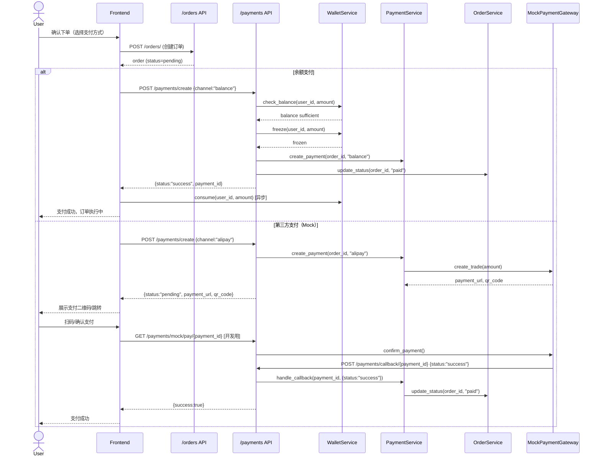
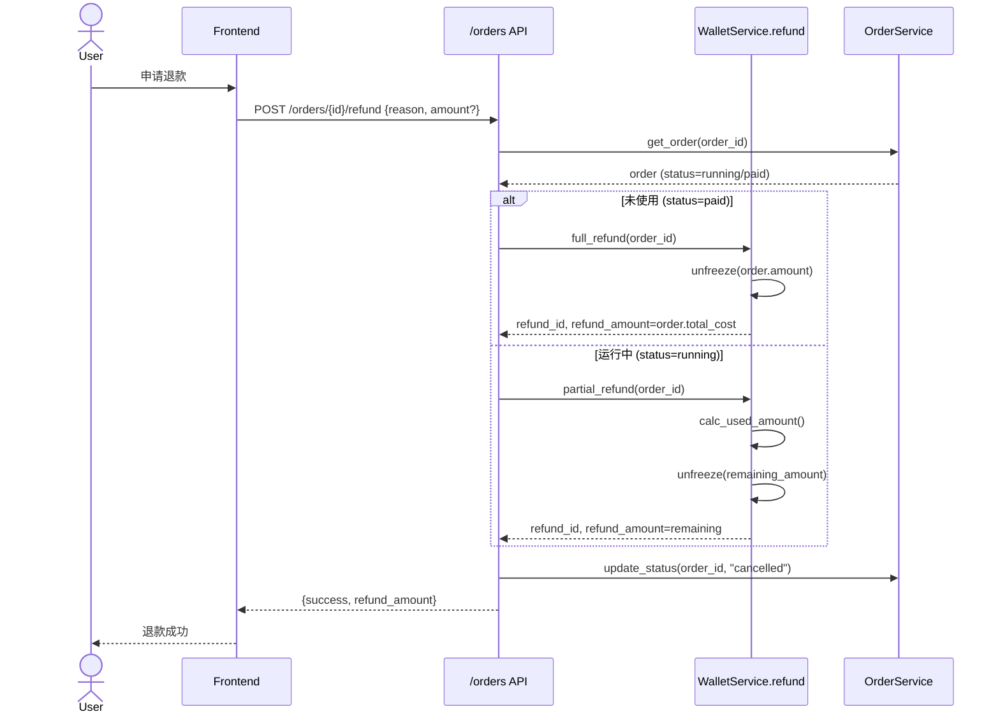
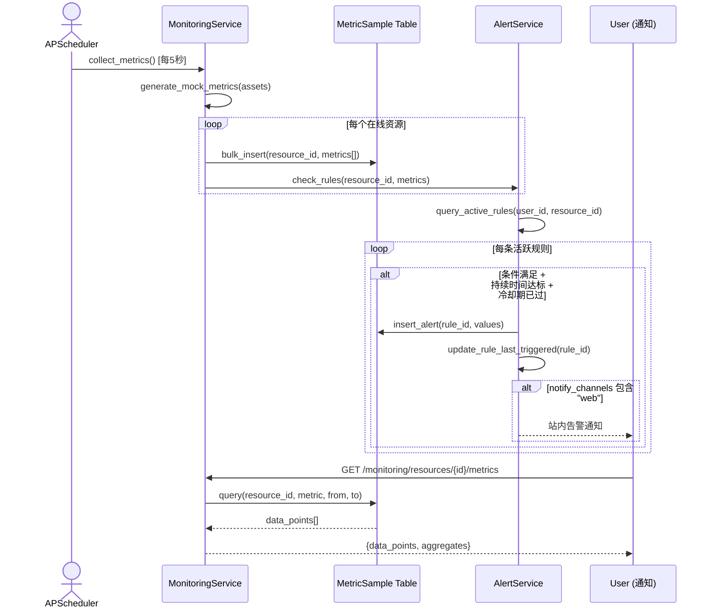
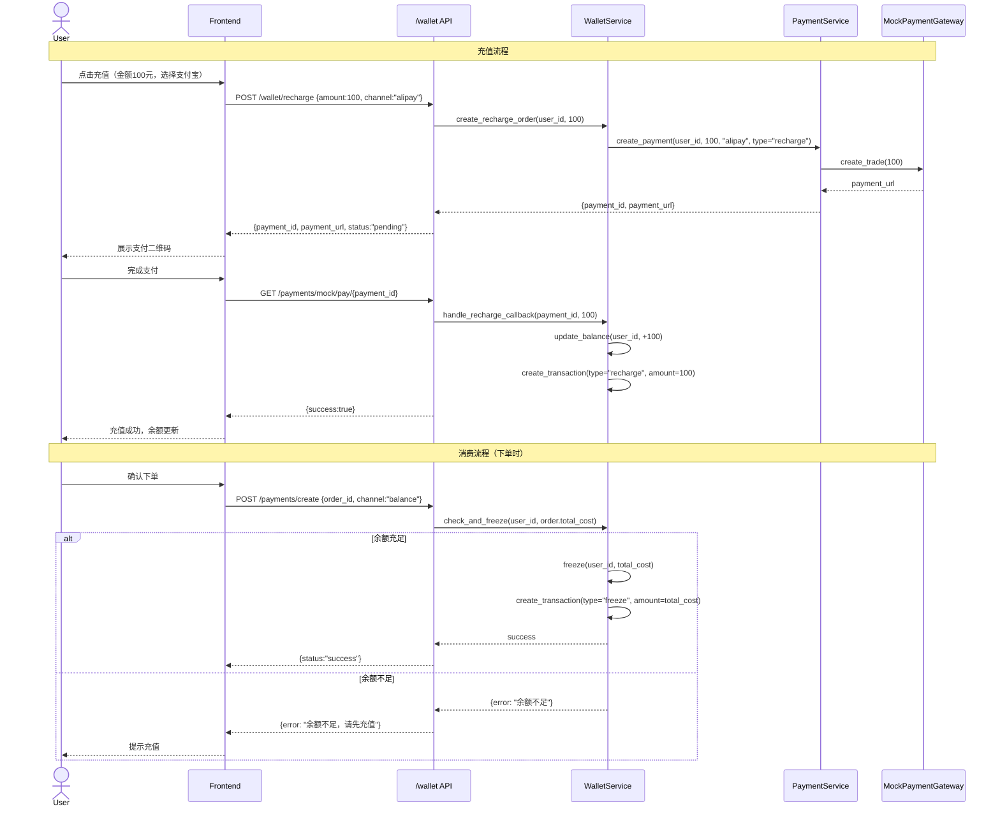

# 算电协同产业互联网平台 Phase 2 系统架构设计文档

**版本**: v1.0
**日期**: 2026-05-12
**架构师**: 高见远（Gao）
**基于**: Phase 2 增量 PRD v1.0（许清楚）
**状态**: 待评审

---

## 1. 实现方案概述

### 1.1 总体架构策略

Phase 2 采用**增量升级**策略，在 Phase 1 现有代码基础上进行修改和新增，**不推翻重写**。

| 原则 | 说明 |
|------|------|
| **增量升级** | 保留 Phase 1 全部现有文件，在其基础上修改/新增 |
| **最小侵入** | 修改现有文件时保持原接口签名兼容 |
| **模块化** | 新增功能作为独立模块，与现有代码低耦合 |
| **渐进式** | P0 先实现核心闭环，P1/P2 逐步增强 |
| **Mock 可切换** | 支付用 Mock Gateway，监控用模拟采集，架构预留真实对接接口 |
| **SQLite 兼容** | 开发环境继续支持 SQLite，生产环境切换 PostgreSQL |

### 1.2 分阶段实施路线图

```
Phase 2 MVP (P0) ─────────────────────── Phase 2.1 (P1) ────────────────── Phase 2.2 (P2)
├─ Step 1: 数据模型层                     ├─ Spot 竞价模块                  ├─ 碳交易
│  ├─ Payment, Wallet, Transaction       ├─ 峰谷定价引擎                   ├─ API 开放平台
│  ├─ MonthlyBill, Invoice               ├─ 绿证交易模块                   ├─ 移动端
│  ├─ MetricSample, AlertRule            ├─ 需求响应模块                   └─ 智能调度
│  └─ Order 模型扩展                      └─ Provider 资质审核
├─ Step 2: 后端服务层
│  ├─ PaymentService (Mock Gateway)
│  ├─ WalletService
│  ├─ BillingService
│  ├─ MonitoringService (结构化模拟)
│  ├─ MarketplaceService (真实搜索)
│  └─ OrderService (生命周期扩展)
├─ Step 3: 后端 API 层
│  ├─ 支付 / 钱包 / 账单 API
│  ├─ 监控 / 告警 API
│  └─ 市场 / 订单 API 增强
├─ Step 4: 前端页面与组件
│  ├─ 钱包页 / 账单页 / 充值弹窗
│  ├─ 监控面板重构
│  ├─ 市场搜索/详情页
│  └─ 订单增强（评价、全状态）
└─ Step 5: 集成测试与联调
```

### 1.3 架构总览

```
┌─────────────────────────────────────────────────────────────────────────┐
│                           Frontend (React 18)                          │
│  ┌──────────┐ ┌──────────┐ ┌──────────┐ ┌──────────┐ ┌──────────┐     │
│  │ Marketplace│ │  Wallet  │ │Billing   │ │Monitoring│ │  Orders  │     │
│  │ (增强)    │ │ (新增)   │ │ (新增)   │ │ (重构)   │ │ (增强)   │     │
│  └────┬─────┘ └────┬─────┘ └────┬─────┘ └────┬─────┘ └────┬─────┘     │
│       └─────────────┴─────────────┴─────────────┴─────────────┘          │
│                          api.ts / Zustand Stores                        │
└──────────────────────────────┬──────────────────────────────────────────┘
                               │ REST API (/api/v1/)
┌──────────────────────────────┴──────────────────────────────────────────┐
│                        Backend (FastAPI)                                │
│  ┌──────────┐ ┌──────────┐ ┌──────────┐ ┌──────────┐ ┌──────────┐     │
│  │payments  │ │ wallet   │ │billing   │ │monitoring│ │marketplace│     │
│  │(重写)    │ │ (新增)   │ │ (新增)   │ │ (重写)   │ │ (重写)    │     │
│  └────┬─────┘ └────┬─────┘ └────┬─────┘ └────┬─────┘ └────┬─────┘     │
│  ┌──────────┐ ┌──────────┐ ┌──────────┐ ┌──────────┐ ┌──────────┐     │
│  │payment   │ │wallet    │ │billing   │ │monitoring│ │marketplace│     │
│  │_service  │ │_service  │ │_service  │ │_service  │ │_service   │     │
│  └────┬─────┘ └────┬─────┘ └────┬─────┘ └────┬─────┘ └────┬─────┘     │
│       └─────────────┴─────────────┴─────────────┴─────────────┘          │
│                          SQLAlchemy 2.0 ORM                             │
└──────────────────────────────┬──────────────────────────────────────────┘
                               │
┌──────────────────────────────┴──────────────────────────────────────────┐
│                    Database Layer                                       │
│  ┌──────────────────────┐  ┌──────────────────────────────────┐        │
│  │ SQLite / PostgreSQL  │  │ 内存 MetricBuffer (后续→InfluxDB) │        │
│  │ (关系数据)            │  │ (时序数据)                       │        │
│  └──────────────────────┘  └──────────────────────────────────┘        │
└─────────────────────────────────────────────────────────────────────────┘
```

---

## 2. 框架选型

### 2.1 核心技术栈（沿用 Phase 1）

| 层 | 技术 | 版本 | 说明 |
|----|------|------|------|
| 前端框架 | React | 18.x | 沿用 |
| 类型系统 | TypeScript | 5.x | 沿用 |
| UI 库 | Ant Design | 5.x | 沿用 |
| 构建工具 | Vite | 5.x | 沿用 |
| 状态管理 | Zustand | 4.x | 沿用 |
| 图表 | ECharts | 5.x | 沿用 |
| HTTP 客户端 | Axios | 1.x | 沿用 |
| 路由 | React Router DOM | 6.x | 沿用 |
| 后端框架 | FastAPI | 0.115+ | 沿用 |
| ORM | SQLAlchemy | 2.0.x | 沿用 |
| 数据校验 | Pydantic V2 | 2.x | 沿用 |
| 认证 | python-jose (JWT) | 3.x | 沿用 |
| ASGI 服务器 | uvicorn | 0.30+ | 沿用 |

### 2.2 新增组件选型

| 组件 | 选型 | 版本 | 用途 | 说明 |
|------|------|------|------|------|
| 数据库迁移 | Alembic | 1.x | Schema 版本管理 | SQLAlchemy 官方迁移工具 |
| 时间处理 | python-dateutil | 2.x | 峰谷时段判断 | 比标准库更灵活 |
| 调度器 | APScheduler | 3.x | 定时任务（账单生成、告警检查） | 轻量级，不引入 Celery |
| UUID | uuid (stdlib) | - | 主键生成 | 替代时间戳拼接 |
| 金额计算 | Decimal (stdlib) | - | 精确金额运算 | 避免 Float 精度问题 |
| 监控存储 | 内存 Buffer + SQLite | - | 时序数据暂存 | 后续可平滑迁移 InfluxDB |
| 前端日期 | dayjs | 1.x | 已有，用于账单/交易日期 | 沿用 |

### 2.3 数据库升级路径

```
Phase 1: SQLite (单文件，开发环境)
    │
    ▼ Phase 2 Step 1: 引入 Alembic
    │  - 新增 alembic/ 目录
    │  - 生成初始迁移脚本
    │  - SQLite 模式下正常使用
    │
    ▼ Phase 2 生产部署: PostgreSQL
    │  - 修改 DATABASE_URL 环境变量
    │  - alembic upgrade head
    │  - 所有模型使用标准 SQL 类型，已兼容
    │
    ▼ Phase 2.1+: 可选 InfluxDB
       - 时序数据迁移到 InfluxDB
       - MetricSample 表保留为备份
```

**关键兼容性措施**:
- JSON 类型：SQLite 支持（通过 TEXT 存储），PostgreSQL 原生支持
- DateTime：两者通用
- Decimal：SQLite 通过 NUMERIC，PostgreSQL 原生 NUMERIC
- Boolean：SQLite 0/1 整数，PostgreSQL 原生 BOOLEAN（SQLAlchemy 自动处理）
- String 主键：两者通用

---

## 3. 文件列表及相对路径

### 3.1 后端文件清单

#### 基础设施（新增）
| 文件路径 | 操作 | 说明 |
|----------|------|------|
| `backend/alembic.ini` | 新增 | Alembic 配置 |
| `backend/alembic/env.py` | 新增 | Alembic 环境配置 |
| `backend/alembic/versions/001_initial_models.py` | 新增 | 初始迁移（现有 4 表） |
| `backend/alembic/versions/002_phase2_models.py` | 新增 | Phase 2 新增表迁移 |

#### 数据模型层（models/）
| 文件路径 | 操作 | 说明 |
|----------|------|------|
| `backend/app/models/base.py` | 修改 | 添加通用字段 created_at/updated_at |
| `backend/app/models/user.py` | 修改 | 添加 phone/company_name 等字段 |
| `backend/app/models/asset.py` | 修改 | 添加 availability_sla/rating 等字段 |
| `backend/app/models/order.py` | 修改 | 添加 payment_id/paid_at/completed_at/instance_type/review 等字段 |
| `backend/app/models/payment.py` | 新增 | Payment 支付记录模型 |
| `backend/app/models/wallet.py` | 新增 | Wallet 钱包 + Transaction 流水模型 |
| `backend/app/models/billing.py` | 新增 | MonthlyBill 月账单 + Invoice 发票模型 |
| `backend/app/models/monitoring.py` | 新增 | MetricSample 指标采样 + AlertRule 告警规则 + Alert 告警记录模型 |
| `backend/app/models/marketplace.py` | 新增 | SpotConfig Spot 配置模型 |
| `backend/app/models/__init__.py` | 修改 | 导出所有模型（供 Alembic 使用） |

#### Schema 层（schemas/）
| 文件路径 | 操作 | 说明 |
|----------|------|------|
| `backend/app/schemas/user.py` | 修改 | 添加 phone/company_name |
| `backend/app/schemas/asset.py` | 修改 | 添加 marketplace 搜索/详情 Schema |
| `backend/app/schemas/order.py` | 修改 | 添加 paid/completed/instance_type/review Schema |
| `backend/app/schemas/payment.py` | 新增 | PaymentCreate/PaymentResponse/PaymentCallback |
| `backend/app/schemas/wallet.py` | 新增 | WalletBalance/WalletRecharge/Withdraw/TransactionRecord |
| `backend/app/schemas/billing.py` | 新增 | MonthlyBillResponse/InvoiceCreate/InvoiceResponse |
| `backend/app/schemas/monitoring.py` | 新增 | MetricQuery/MetricResponse/AlertRuleCreate/AlertResponse |
| `backend/app/schemas/marketplace.py` | 新增 | ResourceSearch/ResourceDetail/SpotConfig Schema |
| `backend/app/schemas/common.py` | 新增 | 通用分页/响应/排序 Schema |

#### 服务层（services/）
| 文件路径 | 操作 | 说明 |
|----------|------|------|
| `backend/app/services/payment_service.py` | 重写 | Mock Payment Gateway 实现 |
| `backend/app/services/wallet_service.py` | 新增 | 钱包 CRUD + 充值/消费/提现/退款 + 事务安全 |
| `backend/app/services/billing_service.py` | 新增 | 月度账单生成 + 发票管理 + 对账 |
| `backend/app/services/monitoring_service.py` | 重写 | 结构化模拟采集 + 告警检查 + 历史查询 |
| `backend/app/services/marketplace_service.py` | 重写 | 真实搜索 + 筛选 + 排序 + 详情 |
| `backend/app/services/order_service.py` | 修改 | 全生命周期管理 + 评价 |
| `backend/app/services/scheduling_service.py` | 修改 | 峰谷定价 + 价格计算 |
| `backend/app/services/__init__.py` | 修改 | 导出所有服务 |

#### API 路由层（api/）
| 文件路径 | 操作 | 说明 |
|----------|------|------|
| `backend/app/api/payments.py` | 重写 | 支付创建 + 回调 + 状态查询 |
| `backend/app/api/wallet.py` | 新增 | 钱包余额/充值/提现/交易记录 |
| `backend/app/api/billing.py` | 新增 | 账单查询/发票申请/发票列表 |
| `backend/app/api/monitoring.py` | 重写 | 指标查询 + 告警规则 CRUD + 告警列表 |
| `backend/app/api/marketplace.py` | 重写 | 资源搜索/详情/Spot 列表 |
| `backend/app/api/orders.py` | 修改 | 添加评价接口 + 退款接口 + 全状态流转 |
| `backend/app/api/__init__.py` | 修改 | 无变更 |

#### 核心模块（core/）
| 文件路径 | 操作 | 说明 |
|----------|------|------|
| `backend/app/core/config.py` | 修改 | 添加支付/钱包/账单/告警相关配置项 |
| `backend/app/core/security.py` | 修改 | 添加获取当前用户依赖函数 |
| `backend/app/core/pricing.py` | 新增 | 峰谷定价计算工具 |

#### 应用入口
| 文件路径 | 操作 | 说明 |
|----------|------|------|
| `backend/app/main.py` | 修改 | 注册新路由 + 初始化定时任务 + 初始化 Mock 数据 |
| `backend/app/database.py` | 修改 | 导入新模型确保建表 |

#### 其他
| 文件路径 | 操作 | 说明 |
|----------|------|------|
| `backend/requirements.txt` | 修改 | 添加新依赖 |
| `backend/.env.example` | 新增 | 环境变量模板 |

### 3.2 前端文件清单

#### 类型定义（types/）
| 文件路径 | 操作 | 说明 |
|----------|------|------|
| `frontend/src/types/asset.types.ts` | 修改 | 添加 marketplace 搜索/详情/Spot 类型 |
| `frontend/src/types/order.types.ts` | 修改 | 添加 paid 状态 + review + refund 类型 |
| `frontend/src/types/payment.types.ts` | 新增 | Payment/Wallet/Transaction/Invoice 类型 |
| `frontend/src/types/billing.types.ts` | 新增 | MonthlyBill/Invoice 类型 |
| `frontend/src/types/monitoring.types.ts` | 新增 | Metric/AlertRule/Alert 类型 |
| `frontend/src/types/common.types.ts` | 新增 | Pagination/SortOption 通用类型 |

#### API 服务（services/）
| 文件路径 | 操作 | 说明 |
|----------|------|------|
| `frontend/src/services/api.ts` | 修改 | 无结构性变更，保持兼容 |
| `frontend/src/services/paymentApi.ts` | 新增 | 支付/钱包/账单 API 调用封装 |
| `frontend/src/services/marketplaceApi.ts` | 新增 | 市场 API 调用封装 |
| `frontend/src/services/monitoringApi.ts` | 新增 | 监控/告警 API 调用封装 |

#### 状态管理（store/）
| 文件路径 | 操作 | 说明 |
|----------|------|------|
| `frontend/src/store/authStore.ts` | 修改 | 无结构性变更 |
| `frontend/src/store/walletStore.ts` | 新增 | 钱包状态管理 |
| `frontend/src/store/orderStore.ts` | 新增 | 订单状态管理 |

#### 页面（pages/）
| 文件路径 | 操作 | 说明 |
|----------|------|------|
| `frontend/src/pages/Marketplace/index.tsx` | 重写 | 搜索/筛选/排序/资源详情 |
| `frontend/src/pages/Marketplace/ResourceDetail.tsx` | 新增 | 资源详情页 |
| `frontend/src/pages/Marketplace/SpotMarket.tsx` | 新增 | Spot 竞价市场页（P1） |
| `frontend/src/pages/Wallet/index.tsx` | 新增 | 钱包主页（余额/交易） |
| `frontend/src/pages/Wallet/Recharge.tsx` | 新增 | 充值页 |
| `frontend/src/pages/Wallet/Withdraw.tsx` | 新增 | 提现页 |
| `frontend/src/pages/Billing/index.tsx` | 新增 | 账单列表页 |
| `frontend/src/pages/Billing/MonthlyDetail.tsx` | 新增 | 月度账单详情 |
| `frontend/src/pages/Billing/InvoiceList.tsx` | 新增 | 发票列表页 |
| `frontend/src/pages/Monitoring/index.tsx` | 重写 | 真实监控面板 + 告警配置 |
| `frontend/src/pages/Monitoring/AlertRules.tsx` | 新增 | 告警规则管理 |
| `frontend/src/pages/Orders/index.tsx` | 修改 | 增强状态展示 + 评价入口 |
| `frontend/src/pages/Payment/index.tsx` | 重写 | 支付选择（余额/第三方） |
| `frontend/src/pages/Home/index.tsx` | 修改 | 添加钱包概览/最近交易 |

#### 组件（components/）
| 文件路径 | 操作 | 说明 |
|----------|------|------|
| `frontend/src/components/Wallet/WalletBalance.tsx` | 新增 | 钱包余额卡片组件 |
| `frontend/src/components/Wallet/TransactionList.tsx` | 新增 | 交易流水列表组件 |
| `frontend/src/components/Wallet/RechargeModal.tsx` | 新增 | 充值弹窗组件 |
| `frontend/src/components/Marketplace/ResourceCard.tsx` | 新增 | 资源卡片组件 |
| `frontend/src/components/Marketplace/SearchFilters.tsx` | 新增 | 搜索筛选栏组件 |
| `frontend/src/components/Marketplace/PriceCalculator.tsx` | 新增 | 价格计算器组件 |
| `frontend/src/components/Monitoring/MetricChart.tsx` | 新增 | 指标图表组件 |
| `frontend/src/components/Monitoring/AlertRuleForm.tsx` | 新增 | 告警规则表单组件 |
| `frontend/src/components/Order/OrderTimeline.tsx` | 新增 | 订单状态时间线组件 |
| `frontend/src/components/Order/ReviewForm.tsx` | 新增 | 评价表单组件 |
| `frontend/src/components/Order/RefundModal.tsx` | 新增 | 退款弹窗组件 |
| `frontend/src/components/Layout/index.tsx` | 修改 | 添加钱包/账单导航项 |

#### 路由
| 文件路径 | 操作 | 说明 |
|----------|------|------|
| `frontend/src/router/routes.tsx` | 修改 | 添加钱包/账单/市场详情路由 |

---

## 4. 数据结构和接口设计

### 4.1 数据模型定义

#### 4.1.1 Payment（支付记录）

```python
# backend/app/models/payment.py
from sqlalchemy import Column, String, Numeric, DateTime, ForeignKey
from sqlalchemy.dialects.postgresql import ENUM
from app.models.base import BaseModel

class Payment(BaseModel):
    __tablename__ = "payments"

    order_id = Column(String, ForeignKey("orders.id"), index=True, nullable=False)
    user_id = Column(String, ForeignKey("users.id"), index=True, nullable=False)
    channel = Column(String, nullable=False)  # balance / alipay / wechat / bankcard
    amount = Column(Numeric(12, 2), nullable=False)
    status = Column(String, default="pending")  # pending / success / failed / refunded / partial_refunded
    trade_no = Column(String, index=True)  # 第三方交易号
    paid_at = Column(DateTime)
    callback_data = Column(String)  # 回调原始数据(JSON string)
    refund_amount = Column(Numeric(12, 2), default=0)
    refund_reason = Column(String)
```

#### 4.1.2 Wallet（钱包）+ Transaction（交易流水）

```python
# backend/app/models/wallet.py
from sqlalchemy import Column, String, Numeric, DateTime, ForeignKey, Text
from app.models.base import BaseModel

class Wallet(BaseModel):
    __tablename__ = "wallets"

    user_id = Column(String, ForeignKey("users.id"), unique=True, index=True, nullable=False)
    balance = Column(Numeric(12, 2), default=0, nullable=False)  # 可用余额
    frozen = Column(Numeric(12, 2), default=0, nullable=False)  # 冻结金额
    total_recharge = Column(Numeric(12, 2), default=0)
    total_withdraw = Column(Numeric(12, 2), default=0)
    total_consume = Column(Numeric(12, 2), default=0)
    credit_limit = Column(Numeric(12, 2), default=0)  # 信用额度(0=无)
    low_balance_alert = Column(Numeric(12, 2), default=100)  # 低余额告警阈值


class Transaction(BaseModel):
    __tablename__ = "transactions"

    wallet_id = Column(String, ForeignKey("wallets.id"), index=True, nullable=False)
    user_id = Column(String, ForeignKey("users.id"), index=True, nullable=False)
    type = Column(String, nullable=False)  # recharge / consume / withdraw / refund / freeze / unfreeze
    amount = Column(Numeric(12, 2), nullable=False)
    balance_after = Column(Numeric(12, 2), nullable=False)
    order_id = Column(String, ForeignKey("orders.id"), index=True)  # 关联订单(消费/退款时)
    payment_id = Column(String, ForeignKey("payments.id"))  # 关联支付(充值时)
    remark = Column(String, default="")
```

#### 4.1.3 MonthlyBill（月度账单）+ Invoice（发票）

```python
# backend/app/models/billing.py
from sqlalchemy import Column, String, Numeric, Integer, DateTime, ForeignKey
from app.models.base import BaseModel

class MonthlyBill(BaseModel):
    __tablename__ = "monthly_bills"

    user_id = Column(String, ForeignKey("users.id"), index=True, nullable=False)
    year = Column(Integer, nullable=False)
    month = Column(Integer, nullable=False)
    total_amount = Column(Numeric(12, 2), default=0)  # 账单总额
    compute_fee = Column(Numeric(12, 2), default=0)  # 算力费用
    energy_fee = Column(Numeric(12, 2), default=0)  # 电力费用
    network_fee = Column(Numeric(12, 2), default=0)  # 网络费用
    storage_fee = Column(Numeric(12, 2), default=0)  # 存储费用
    green_cert_discount = Column(Numeric(12, 2), default=0)  # 绿证抵扣
    actual_pay = Column(Numeric(12, 2), default=0)  # 实付金额
    order_count = Column(Integer, default=0)  # 订单数量
    status = Column(String, default="generated")  # generated / paid / overdue


class Invoice(BaseModel):
    __tablename__ = "invoices"

    bill_id = Column(String, ForeignKey("monthly_bills.id"), index=True, nullable=False)
    user_id = Column(String, ForeignKey("users.id"), index=True, nullable=False)
    type = Column(String, default="normal")  # normal / vat_special / vat_digital
    title = Column(String, nullable=False)  # 发票抬头
    tax_no = Column(String, nullable=False)  # 税号
    amount = Column(Numeric(12, 2), nullable=False)
    status = Column(String, default="pending")  # pending / issued / sent / failed
    issued_at = Column(DateTime)
    sent_at = Column(DateTime)
    file_url = Column(String)  # 发票文件 URL
```

#### 4.1.4 MetricSample（指标采样）+ AlertRule（告警规则）+ Alert（告警记录）

```python
# backend/app/models/monitoring.py
from sqlalchemy import Column, String, Float, Integer, DateTime, ForeignKey, Text, JSON
from app.models.base import BaseModel

class MetricSample(BaseModel):
    __tablename__ = "metric_samples"

    resource_id = Column(String, index=True, nullable=False)  # 资源ID (asset_id 或 order_id)
    metric_name = Column(String, index=True, nullable=False)  # gpu_util / gpu_memory / cpu_util / memory / power / pue / temperature
    value = Column(Float, nullable=False)
    timestamp = Column(DateTime, index=True, nullable=False)
    tags = Column(String)  # JSON string，如 {"region":"nx","provider":"gpu-farm"}


class AlertRule(BaseModel):
    __tablename__ = "alert_rules"

    user_id = Column(String, ForeignKey("users.id"), index=True, nullable=False)
    resource_id = Column(String, index=True)  # 空=全局规则
    name = Column(String, nullable=False)  # 规则名称
    metric = Column(String, nullable=False)  # 监控指标名
    condition = Column(String, nullable=False)  # gt / lt / eq / gte / lte
    threshold = Column(Float, nullable=False)  # 阈值
    duration_seconds = Column(Integer, default=0)  # 持续时间(秒), 0=立即触发
    notify_channels = Column(String, default="web")  # web / email / sms, 逗号分隔
    cooldown_seconds = Column(Integer, default=300)  # 告警冷却时间(秒)
    is_active = Column(Integer, default=1)  # 1=启用 0=禁用
    last_triggered_at = Column(DateTime)


class Alert(BaseModel):
    __tablename__ = "alerts"

    rule_id = Column(String, ForeignKey("alert_rules.id"), index=True)
    user_id = Column(String, ForeignKey("users.id"), index=True, nullable=False)
    resource_id = Column(String, index=True, nullable=False)
    metric = Column(String, nullable=False)
    value = Column(Float, nullable=False)
    threshold = Column(Float, nullable=False)
    condition = Column(String, nullable=False)
    status = Column(String, default="triggered")  # triggered / resolved / silenced
    resolved_at = Column(DateTime)
    message = Column(String, default="")
```

#### 4.1.5 现有模型扩展

**Order 模型扩展字段**:
```python
# backend/app/models/order.py - 新增字段
payment_id = Column(String, ForeignKey("payments.id"))  # 关联支付记录
paid_at = Column(DateTime)  # 支付时间
completed_at = Column(DateTime)  # 完成时间
cancelled_at = Column(DateTime)  # 取消时间
instance_type = Column(String, default="on_demand")  # on_demand / reserved / spot
review_score = Column(Integer)  # 综合评分 1-5
review_text = Column(String)  # 评价内容
reviewed_at = Column(DateTime)  # 评价时间
refund_status = Column(String, default="none")  # none / pending / approved / rejected / completed
refund_amount = Column(Numeric(12, 2), default=0)
refund_reason = Column(String)
```

**Asset 模型扩展字段**:
```python
# backend/app/models/asset.py - 新增字段
availability_sla = Column(Float, default=99.9)  # SLA 可用性
rating = Column(Float, default=0)  # 平均评分
total_orders = Column(Integer, default=0)  # 累计订单数
pricing_type = Column(String, default="fixed")  # fixed / spot / auction
```

**User 模型扩展字段**:
```python
# backend/app/models/user.py - 新增字段
phone = Column(String)  # 手机号
company_name = Column(String)  # 公司名称
```

#### 4.1.6 SpotConfig（Spot 配置）- P1

```python
# backend/app/models/marketplace.py
from sqlalchemy import Column, String, Numeric, Integer, Boolean, ForeignKey
from app.models.base import BaseModel

class SpotConfig(BaseModel):
    __tablename__ = "spot_configs"

    asset_id = Column(String, ForeignKey("assets.id"), unique=True, index=True, nullable=False)
    min_price = Column(Numeric(12, 2), nullable=False)  # 最低价格
    max_price = Column(Numeric(12, 2), nullable=False)  # 最高价格
    current_price = Column(Numeric(12, 2))  # 当前竞价价格
    interruptible = Column(Integer, default=1)  # 是否可中断
    notification_minutes = Column(Integer, default=5)  # 中断前通知分钟数
    status = Column(String, default="available")  # available / allocated / maintenance
```

### 4.2 模型关系图（Mermaid ER）

```mermaid
erDiagram
    User ||--o| Wallet : "has"
    User ||--o{ Order : "creates"
    User ||--o{ Payment : "makes"
    User ||--o{ MonthlyBill : "receives"
    User ||--o{ Invoice : "owns"
    User ||--o{ AlertRule : "configures"
    User ||--o{ Alert : "receives"
    User ||--o| Asset : "provides"

    Wallet ||--o{ Transaction : "has"

    Order ||--o| Payment : "paid_by"
    Order }o--|| Asset : "uses"

    Payment ||--o{ Transaction : "triggers"

    MonthlyBill ||--o{ Invoice : "issues"
    MonthlyBill }o--|| User : "belongs_to"

    AlertRule ||--o{ Alert : "generates"

    Asset ||--o| SpotConfig : "has"
    Asset ||--o{ MetricSample : "measured_by"

    User {
        string id PK
        string username UK
        string email UK
        string hashed_password
        string role
        boolean is_active
        string phone
        string company_name
    }

    Wallet {
        string id PK
        string user_id FK_UK
        decimal balance
        decimal frozen
        decimal total_recharge
        decimal total_withdraw
        decimal total_consume
        decimal credit_limit
        decimal low_balance_alert
    }

    Transaction {
        string id PK
        string wallet_id FK
        string user_id FK
        string type
        decimal amount
        decimal balance_after
        string order_id FK
        string payment_id FK
        string remark
    }

    Order {
        string id PK
        string user_id FK
        string asset_id FK
        string payment_id FK
        string status
        decimal compute_cost
        decimal energy_cost
        decimal total_cost
        string instance_type
        int review_score
        string review_text
        string refund_status
        decimal refund_amount
        datetime paid_at
        datetime completed_at
    }

    Payment {
        string id PK
        string order_id FK
        string user_id FK
        string channel
        decimal amount
        string status
        string trade_no
        datetime paid_at
    }

    MonthlyBill {
        string id PK
        string user_id FK
        int year
        int month
        decimal total_amount
        decimal compute_fee
        decimal energy_fee
        decimal actual_pay
        string status
    }

    Invoice {
        string id PK
        string bill_id FK
        string user_id FK
        string type
        string title
        string tax_no
        decimal amount
        string status
    }

    MetricSample {
        string id PK
        string resource_id
        string metric_name
        float value
        datetime timestamp
    }

    AlertRule {
        string id PK
        string user_id FK
        string resource_id
        string name
        string metric
        string condition
        float threshold
        int duration_seconds
        string notify_channels
    }

    Alert {
        string id PK
        string rule_id FK
        string user_id FK
        string resource_id
        string status
        float value
    }
```

### 4.3 API 接口设计

#### 4.3.1 支付 API（重写 `api/payments.py`）

```
POST   /api/v1/payments/create
  Body: { order_id: str, channel: "balance"|"alipay"|"wechat"|"bankcard" }
  Response: {
    payment_id: str,
    channel: str,
    amount: Decimal,
    status: "pending"|"success",
    payment_url?: str,     # 第三方支付跳转URL（Mock时为模拟URL）
    qr_code?: str          # 二维码内容（Mock时为base64模拟图）
  }
  说明: 创建支付请求。balance 通道直接扣款；其他通道返回模拟支付信息。

POST   /api/v1/payments/callback/{payment_id}
  Body: { status: "success"|"failed", trade_no: str, amount: Decimal }
  Response: { success: bool, message: str }
  说明: 第三方支付回调（Mock Gateway 调用）。更新支付和订单状态。

GET    /api/v1/payments/{payment_id}
  Response: {
    id: str, order_id: str, user_id: str,
    channel: str, amount: Decimal, status: str,
    trade_no: str, paid_at: datetime
  }

GET    /api/v1/payments/order/{order_id}
  Response: Payment | null
  说明: 根据订单ID查询支付记录。

GET    /api/v1/payments/mock/pay/{payment_id}
  Response: { success: bool, message: str }
  说明: [开发用] 模拟支付成功回调。
```

#### 4.3.2 钱包 API（新增 `api/wallet.py`）

```
GET    /api/v1/wallet/balance
  Response: {
    balance: Decimal,
    frozen: Decimal,
    available: Decimal,        # balance - frozen
    total_recharge: Decimal,
    total_withdraw: Decimal,
    total_consume: Decimal,
    credit_limit: Decimal,
    low_balance_alert: Decimal
  }
  说明: 查询当前用户钱包信息，不存在时自动创建。

POST   /api/v1/wallet/recharge
  Body: { amount: Decimal, channel: "alipay"|"wechat"|"bankcard" }
  Response: {
    payment_id: str,
    transaction_id: str,
    amount: Decimal,
    payment_url: str,         # 模拟支付URL
    status: "pending"
  }
  说明: 创建充值订单，实际充值在支付回调完成后执行。

POST   /api/v1/wallet/withdraw
  Body: { amount: Decimal, bank_card: str, bank_name: str, account_name: str }
  Response: {
    withdraw_id: str,         # 实际为 transaction_id
    amount: Decimal,
    status: "pending",
    message: str
  }
  说明: 发起提现申请。T+1审核，冻结对应金额。

PUT    /api/v1/wallet/low-balance-alert
  Body: { threshold: Decimal }
  Response: { success: bool, threshold: Decimal }
  说明: 设置低余额告警阈值。

GET    /api/v1/wallet/transactions
  Query: type?, page=1, page_size=20, start_date?, end_date?
  Response: {
    items: [{
      id: str, type: str, amount: Decimal,
      balance_after: Decimal, order_id: str,
      remark: str, created_at: datetime
    }],
    total: int, page: int, page_size: int
  }
  说明: 查询交易流水，支持按类型筛选和时间范围。
```

#### 4.3.3 账单 API（新增 `api/billing.py`）

```
GET    /api/v1/bills/monthly
  Query: year=2026, month=5
  Response: MonthlyBill | null
  说明: 查询指定月份账单。不存在时自动生成。

POST   /api/v1/bills/generate
  Body: { year: int, month: int }
  Response: MonthlyBill
  说明: 手动触发生成月度账单（定时任务每月1日自动生成）。

GET    /api/v1/bills/list
  Query: page=1, page_size=12
  Response: {
    items: MonthlyBill[],
    total: int, page: int, page_size: int
  }

POST   /api/v1/bills/{bill_id}/invoice
  Body: {
    type: "normal"|"vat_special"|"vat_digital",
    title: str,
    tax_no: str
  }
  Response: Invoice
  说明: 申请发票。vat_special 需要附加 address/phone/bank_name/bank_account。

GET    /api/v1/bills/invoices
  Query: bill_id?, status?, page=1, page_size=20
  Response: {
    items: Invoice[],
    total: int, page: int, page_size: int
  }

GET    /api/v1/bills/reconciliation
  Query: start_date="2026-05-01", end_date="2026-05-31"
  Response: {
    total_orders: int,
    total_amount: Decimal,
    total_payments: Decimal,
    total_refunds: Decimal,
    discrepancy: Decimal,
    details: [{
      order_id: str, order_amount: Decimal,
      payment_amount: Decimal, status: str
    }]
  }
  说明: 对账管理，核查交易流水与订单一致性。
```

#### 4.3.4 监控 API（重写 `api/monitoring.py`）

```
GET    /api/v1/monitoring/resources/{resource_id}/metrics
  Query:
    metric: "gpu_util"|"gpu_memory"|"cpu_util"|"memory"|"power"|"pue"|"temperature"|"network_io"|"disk_io"
    from: datetime (ISO 8601)
    to: datetime (ISO 8601)
    interval: "5s"|"1m"|"5m"|"1h" (可选，默认1m)
  Response: {
    resource_id: str,
    metric: str,
    data_points: [{ timestamp: datetime, value: float }],
    aggregates: { avg: float, max: float, min: float, count: int },
    from: datetime,
    to: datetime
  }

GET    /api/v1/monitoring/resources/{resource_id}/latest
  Response: {
    resource_id: str,
    metrics: {
      gpu_util: float,
      gpu_memory: float,
      cpu_util: float,
      memory: float,
      power: float,
      temperature: float,
      timestamp: datetime
    }
  }
  说明: 获取资源最新指标快照。

POST   /api/v1/monitoring/alert-rules
  Body: {
    name: str,
    resource_id?: str,
    metric: str,
    condition: "gt"|"lt"|"eq"|"gte"|"lte",
    threshold: float,
    duration_seconds?: int,
    notify_channels?: "web,email,sms",
    cooldown_seconds?: int
  }
  Response: AlertRule

GET    /api/v1/monitoring/alert-rules
  Response: AlertRule[]
  说明: 获取当前用户的所有告警规则。

PUT    /api/v1/monitoring/alert-rules/{rule_id}
  Body: { name?, metric?, condition?, threshold?, duration_seconds?, notify_channels?, is_active? }
  Response: AlertRule

DELETE /api/v1/monitoring/alert-rules/{rule_id}
  Response: { success: bool }

GET    /api/v1/monitoring/alerts
  Query: status?, resource_id?, page=1, page_size=20
  Response: {
    items: Alert[],
    total: int, page: int, page_size: int
  }

PUT    /api/v1/monitoring/alerts/{alert_id}/resolve
  Response: Alert
  说明: 手动解除告警。

# 保留原有接口（兼容 Phase 1）
GET    /api/v1/monitoring/tasks/{task_id}       # 保持不变，内部改调新逻辑
GET    /api/v1/monitoring/tasks/{task_id}/logs  # 保持不变
```

#### 4.3.5 算力市场 API（重写 `api/marketplace.py`）

```
GET    /api/v1/marketplace/assets
  Query:
    gpu_model?: str           # A100/H100/V100/L40S
    gpu_count?: int           # 1/4/8
    vram_min?: int            # 最小显存 GB
    region?: str              # 华北/华东/华南/西部
    min_price?: Decimal       # 最低价格
    max_price?: Decimal       # 最高价格
    green_ratio_min?: int     # 最低绿电比例 0-100
    pue_max?: float           # 最高 PUE
    sort?: "price_asc"|"price_desc"|"rating_desc"|"created_desc"
    pricing_type?: "fixed"|"spot"  # 资源类型筛选
    page: int = 1
    page_size: int = 20
  Response: {
    items: [{
      id: str, name: str,
      gpu_model: str, gpu_count: int, vram_total: int,
      cpu: str, memory: int, storage: int,
      region: str, datacenter: str,
      unit_price: Decimal,
      green_ratio: int, pue: float,
      availability_sla: float,
      rating: float, total_orders: int,
      status: str, pricing_type: str
    }],
    total: int, page: int, page_size: int,
    filters_applied: { ... }
  }

GET    /api/v1/marketplace/assets/{asset_id}
  Response: {
    id: str, name: str, owner_id: str,
    specs: { gpu_model, gpu_count, vram_total, cpu, memory, storage, network_bandwidth },
    pricing: { type, unit_price, spot_min_price, spot_max_price },
    energy_profile: { power_source, green_ratio, pue, carbon_intensity },
    location: { region, datacenter, country },
    availability_sla: float,
    rating: float, total_orders: int,
    reviews: [{ user_id, score, text, created_at }]
  }

POST   /api/v1/marketplace/assets/{asset_id}/reviews
  Body: { order_id: str, score: int(1-5), text?: str, anonymous?: bool }
  Response: { success: bool, review_id: str }

# Phase 1 兼容
GET    /api/v1/marketplace/assets               # 同上（已重写）
```

#### 4.3.6 订单 API 增强（修改 `api/orders.py`）

```
# 保留原有接口
GET    /api/v1/orders/                          # 订单列表（增加 status=paid|allocated|completed 支持）
POST   /api/v1/orders/                          # 创建订单
GET    /api/v1/orders/{order_id}                # 订单详情
PUT    /api/v1/orders/{order_id}/pay            # 支付订单（改调 WalletService）
PUT    /api/v1/orders/{order_id}/cancel         # 取消订单（增加退款逻辑）

# 新增接口
PUT    /api/v1/orders/{order_id}/complete
  Response: Order
  说明: 标记订单完成，触发结算。

POST   /api/v1/orders/{order_id}/review
  Body: { score: int(1-5), text?: str }
  Response: { success: bool }
  说明: 订单评价。仅 completed 状态可评价。

POST   /api/v1/orders/{order_id}/refund
  Body: { reason: str, amount?: Decimal }
  Response: {
    success: bool,
    refund_id: str,
    refund_amount: Decimal,
    message: str
  }
  说明: 申请退款。未使用=全额，运行中=按比例。

GET    /api/v1/orders/{order_id}/status-history
  Response: [{
    status: str, changed_at: datetime, remark: str
  }]
  说明: 订单状态变更历史。
```

### 4.4 Pydantic Schema 定义

#### payment.py
```python
from pydantic import BaseModel, Field
from typing import Optional
from datetime import datetime
from decimal import Decimal

class PaymentCreate(BaseModel):
    order_id: str
    channel: str = "balance"  # balance / alipay / wechat / bankcard

class PaymentResponse(BaseModel):
    id: str
    order_id: str
    user_id: str
    channel: str
    amount: Decimal
    status: str
    trade_no: Optional[str] = None
    paid_at: Optional[datetime] = None
    payment_url: Optional[str] = None
    qr_code: Optional[str] = None
    created_at: Optional[datetime] = None
    class Config:
        from_attributes = True

class PaymentCallback(BaseModel):
    status: str  # success / failed
    trade_no: str
    amount: Decimal
```

#### wallet.py
```python
from pydantic import BaseModel
from typing import Optional
from datetime import datetime
from decimal import Decimal

class WalletBalanceResponse(BaseModel):
    balance: Decimal
    frozen: Decimal
    available: Decimal
    total_recharge: Decimal
    total_withdraw: Decimal
    total_consume: Decimal
    credit_limit: Decimal
    low_balance_alert: Decimal

class WalletRechargeRequest(BaseModel):
    amount: Decimal = Field(gt=0)
    channel: str = "alipay"

class WalletWithdrawRequest(BaseModel):
    amount: Decimal = Field(gt=0)
    bank_card: str
    bank_name: str
    account_name: str

class TransactionRecord(BaseModel):
    id: str
    type: str
    amount: Decimal
    balance_after: Decimal
    order_id: Optional[str] = None
    remark: Optional[str] = None
    created_at: Optional[datetime] = None
    class Config:
        from_attributes = True
```

#### billing.py
```python
from pydantic import BaseModel
from typing import Optional
from datetime import datetime
from decimal import Decimal

class MonthlyBillResponse(BaseModel):
    id: str
    user_id: str
    year: int
    month: int
    total_amount: Decimal
    compute_fee: Decimal
    energy_fee: Decimal
    network_fee: Decimal
    storage_fee: Decimal
    green_cert_discount: Decimal
    actual_pay: Decimal
    order_count: int
    status: str
    generated_at: Optional[datetime] = None
    class Config:
        from_attributes = True

class InvoiceCreateRequest(BaseModel):
    type: str = "normal"  # normal / vat_special / vat_digital
    title: str
    tax_no: str
    address: Optional[str] = None
    phone: Optional[str] = None
    bank_name: Optional[str] = None
    bank_account: Optional[str] = None

class InvoiceResponse(BaseModel):
    id: str
    bill_id: str
    type: str
    title: str
    amount: Decimal
    status: str
    issued_at: Optional[datetime] = None
    class Config:
        from_attributes = True
```

#### monitoring.py
```python
from pydantic import BaseModel
from typing import Optional, List
from datetime import datetime

class MetricQueryParams(BaseModel):
    metric: str
    from_time: datetime
    to_time: datetime
    interval: str = "1m"

class DataPoint(BaseModel):
    timestamp: datetime
    value: float

class MetricResponse(BaseModel):
    resource_id: str
    metric: str
    data_points: List[DataPoint]
    aggregates: dict  # {avg, max, min, count}

class AlertRuleCreate(BaseModel):
    name: str
    resource_id: Optional[str] = None
    metric: str
    condition: str  # gt / lt / eq / gte / lte
    threshold: float
    duration_seconds: int = 0
    notify_channels: str = "web"
    cooldown_seconds: int = 300

class AlertRuleUpdate(BaseModel):
    name: Optional[str] = None
    metric: Optional[str] = None
    condition: Optional[str] = None
    threshold: Optional[float] = None
    duration_seconds: Optional[int] = None
    notify_channels: Optional[str] = None
    is_active: Optional[int] = None
```

---

## 5. 程序调用流程

### 5.1 支付流程（钱包余额 + 第三方支付）



### 5.2 退款流程



### 5.3 监控数据采集与告警流程



### 5.4 钱包充值与消费流程



---

## 6. 任务列表

> 按实现顺序排列。每个任务标注 ID、描述、涉及文件、预估复杂度、前置依赖。
> 任务粒度：每个任务约 1-2 小时工作量。

### 6.1 后端 - 基础设施层

| 任务ID | 描述 | 涉及文件 | 复杂度 | 前置依赖 |
|--------|------|----------|--------|----------|
| B-INF-01 | 安装 Alembic，初始化迁移目录和配置 | `alembic.ini`, `alembic/env.py` | 低 | 无 |
| B-INF-02 | 生成 Phase 1 现有表的初始迁移脚本 | `alembic/versions/001_initial_models.py` | 低 | B-INF-01 |
| B-INF-03 | 更新 requirements.txt 添加新依赖 | `requirements.txt` | 低 | 无 |
| B-INF-04 | 更新 config.py 添加 Phase 2 配置项（支付限额、告警冷却、模拟采集间隔等） | `core/config.py` | 低 | 无 |
| B-INF-05 | 在 security.py 中添加 `get_current_user` FastAPI 依赖函数（从 Authorization header 提取 user_id） | `core/security.py` | 低 | 无 |
| B-INF-06 | 新建 `core/pricing.py`：峰谷时段判断 + 价格系数计算工具函数 | `core/pricing.py` | 低 | 无 |

### 6.2 后端 - 数据模型层

| 任务ID | 描述 | 涉及文件 | 复杂度 | 前置依赖 |
|--------|------|----------|--------|----------|
| B-MOD-01 | 修改 `base.py`：确保所有模型有 id/created_at/updated_at（当前 User/Asset/Order 各自定义了 id，需统一） | `models/base.py` | 低 | 无 |
| B-MOD-02 | 修改 `user.py`：添加 phone, company_name 字段 | `models/user.py` | 低 | B-MOD-01 |
| B-MOD-03 | 修改 `asset.py`：添加 availability_sla, rating, total_orders, pricing_type 字段 | `models/asset.py` | 低 | B-MOD-01 |
| B-MOD-04 | 修改 `order.py`：添加 payment_id, paid_at, completed_at, cancelled_at, instance_type, review_score, review_text, reviewed_at, refund_status, refund_amount, refund_reason 字段。添加 started_at 列（当前代码引用但未定义） | `models/order.py` | 中 | B-MOD-01 |
| B-MOD-05 | 新建 `models/payment.py`：Payment 模型 | `models/payment.py` | 低 | B-MOD-01 |
| B-MOD-06 | 新建 `models/wallet.py`：Wallet + Transaction 模型 | `models/wallet.py` | 低 | B-MOD-01 |
| B-MOD-07 | 新建 `models/billing.py`：MonthlyBill + Invoice 模型 | `models/billing.py` | 低 | B-MOD-01 |
| B-MOD-08 | 新建 `models/monitoring.py`：MetricSample + AlertRule + Alert 模型 | `models/monitoring.py` | 低 | B-MOD-01 |
| B-MOD-09 | 新建 `models/marketplace.py`：SpotConfig 模型（P1，先建表） | `models/marketplace.py` | 低 | B-MOD-01 |
| B-MOD-10 | 更新 `models/__init__.py`：导出所有模型（Alembic 需要导入） | `models/__init__.py` | 低 | B-MOD-02~09 |
| B-MOD-11 | 生成 Phase 2 新增表的迁移脚本 | `alembic/versions/002_phase2_models.py` | 中 | B-MOD-10, B-INF-02 |
| B-MOD-12 | 更新 `database.py`：确保导入所有模型，init_db 时自动建表（开发 SQLite 模式） | `database.py` | 低 | B-MOD-10 |

### 6.3 后端 - Schema 层

| 任务ID | 描述 | 涉及文件 | 复杂度 | 前置依赖 |
|--------|------|----------|--------|----------|
| B-SCH-01 | 新建 `schemas/common.py`：PaginationParams, PaginatedResponse, SortOption 通用 Schema | `schemas/common.py` | 低 | 无 |
| B-SCH-02 | 修改 `schemas/user.py`：UserCreate/UserResponse 添加 phone, company_name | `schemas/user.py` | 低 | B-MOD-02 |
| B-SCH-03 | 修改 `schemas/asset.py`：添加 AssetSearchFilters, AssetDetailResponse, AssetCardResponse | `schemas/asset.py` | 中 | B-MOD-03 |
| B-SCH-04 | 修改 `schemas/order.py`：添加 OrderPaid/OrderCompleted/ReviewCreate/RefundRequest/StatusHistory Schema | `schemas/order.py` | 中 | B-MOD-04 |
| B-SCH-05 | 新建 `schemas/payment.py`：PaymentCreate, PaymentResponse, PaymentCallback, PaymentCallbackResult | `schemas/payment.py` | 低 | B-MOD-05 |
| B-SCH-06 | 新建 `schemas/wallet.py`：WalletBalanceResponse, WalletRechargeRequest, WalletWithdrawRequest, TransactionRecord | `schemas/wallet.py` | 低 | B-MOD-06 |
| B-SCH-07 | 新建 `schemas/billing.py`：MonthlyBillResponse, InvoiceCreateRequest, InvoiceResponse, ReconciliationResponse | `schemas/billing.py` | 低 | B-MOD-07 |
| B-SCH-08 | 新建 `schemas/monitoring.py`：MetricQueryParams, DataPoint, MetricResponse, AlertRuleCreate/Update/Response, AlertResponse | `schemas/monitoring.py` | 低 | B-MOD-08 |

### 6.4 后端 - 服务层

| 任务ID | 描述 | 涉及文件 | 复杂度 | 前置依赖 |
|--------|------|----------|--------|----------|
| B-SVC-01 | 新建 MockPaymentGateway 类：create_trade(), confirm_payment(), query_status() — 所有方法返回模拟结果，接口按真实支付网关设计 | `services/payment_service.py` | 中 | B-MOD-05, B-SCH-05 |
| B-SVC-02 | 重写 PaymentService：create_payment()（调用 MockGateway 或 WalletService）、handle_callback()（更新支付状态+订单状态）、get_payment()、get_by_order_id() | `services/payment_service.py` | 中 | B-SVC-01, B-SVC-05 |
| B-SVC-03 | 新建 WalletService：get_or_create_wallet()、check_balance()、freeze()、unfreeze()、consume()、recharge()、withdraw()、refund()、get_transactions()。所有金额操作使用 Decimal，在同一事务中更新 balance/frozen 并写入 Transaction 记录 | `services/wallet_service.py` | 高 | B-MOD-06, B-SCH-06 |
| B-SVC-04 | 新建 BillingService：generate_monthly_bill()（汇总指定月份所有已完成订单费用）、get_bill()、list_bills()、create_invoice()、list_invoices()、reconcile() | `services/billing_service.py` | 中 | B-MOD-07, B-SCH-07 |
| B-SVC-05 | 重写 MonitoringService：generate_mock_metrics()（按资源生成结构化指标，包含峰谷功耗波动特征）、store_metrics()、query_metrics()、get_latest_metrics()、check_alert_rules()、trigger_alert()、resolve_alert() | `services/monitoring_service.py` | 高 | B-MOD-08, B-SCH-08 |
| B-SVC-06 | 重写 MarketplaceService：search_assets()（基于 Asset 表的 SQL 查询 + 多条件筛选 + 排序 + 分页）、get_asset_detail()（聚合评价信息） | `services/marketplace_service.py` | 中 | B-MOD-03, B-SCH-03 |
| B-SVC-07 | 修改 OrderService：添加 complete_order()、review_order()、refund_order()、get_status_history() 方法。create_order 时自动生成 started_at=None/completed_at=None | `services/order_service.py` | 中 | B-MOD-04, B-SVC-03 |
| B-SVC-08 | 修改 SchedulingService：报价计算集成峰谷定价系数（使用 core/pricing.py） | `services/scheduling_service.py` | 中 | B-INF-06 |

### 6.5 后端 - API 路由层

| 任务ID | 描述 | 涉及文件 | 复杂度 | 前置依赖 |
|--------|------|----------|--------|----------|
| B-API-01 | 重写 `api/payments.py`：POST /create（创建支付）、POST /callback/{id}（支付回调）、GET /{id}（查询支付）、GET /order/{order_id}、GET /mock/pay/{id}（开发用模拟支付成功） | `api/payments.py` | 中 | B-SVC-02 |
| B-API-02 | 新建 `api/wallet.py`：GET /balance、POST /recharge、POST /withdraw、PUT /low-balance-alert、GET /transactions | `api/wallet.py` | 中 | B-SVC-03 |
| B-API-03 | 新建 `api/billing.py`：GET /monthly、POST /generate、GET /list、POST /{bill_id}/invoice、GET /invoices、GET /reconciliation | `api/billing.py` | 中 | B-SVC-04 |
| B-API-04 | 重写 `api/monitoring.py`：GET /resources/{id}/metrics、GET /resources/{id}/latest、POST/GET/PUT/DELETE alert-rules、GET alerts。保留 /tasks/{id} 和 /tasks/{id}/logs 兼容接口 | `api/monitoring.py` | 高 | B-SVC-05 |
| B-API-05 | 重写 `api/marketplace.py`：GET /assets（带完整筛选/排序/分页参数）、GET /assets/{id}（详情）、POST /assets/{id}/reviews | `api/marketplace.py` | 中 | B-SVC-06 |
| B-API-06 | 修改 `api/orders.py`：PUT /{id}/pay（改用 WalletService）、PUT /{id}/cancel（增加退款）、PUT /{id}/complete（新增）、POST /{id}/review（新增）、POST /{id}/refund（新增）、GET /{id}/status-history（新增） | `api/orders.py` | 中 | B-SVC-07 |
| B-API-07 | 修改 `api/marketplace.py` 的 GET /assets 端点：添加 pricing_type 筛选参数 | `api/marketplace.py` | 低 | B-API-05 |

### 6.6 后端 - 应用集成

| 任务ID | 描述 | 涉及文件 | 复杂度 | 前置依赖 |
|--------|------|----------|--------|----------|
| B-INT-01 | 修改 `main.py`：注册 wallet、billing 新路由；注册定时任务（监控采集 5s 间隔 + 告警检查 10s 间隔 + 账单生成每月1日） | `main.py` | 中 | B-API-01~06 |
| B-INT-02 | 修改 `main.py`：添加种子数据初始化（生成模拟 Provider 用户 + 模拟 Asset 数据 + 模拟历史订单数据，用于市场搜索和监控） | `main.py` | 中 | B-INT-01 |
| B-INT-03 | 后端集成测试：验证支付→钱包→订单状态联动、监控采集→告警触发、账单生成→发票 | `test_api.py` | 中 | B-INT-02 |

### 6.7 前端 - 类型定义

| 任务ID | 描述 | 涉及文件 | 复杂度 | 前置依赖 |
|--------|------|----------|--------|----------|
| F-TYPE-01 | 新建 `types/common.types.ts`：PaginationParams, PaginatedResponse<T>, SortOption | `types/common.types.ts` | 低 | 无 |
| F-TYPE-02 | 修改 `types/payment.types.ts`：Payment, WalletBalance, TransactionRecord, WalletRecharge, WalletWithdraw 等类型 | `types/payment.types.ts` | 低 | 无 |
| F-TYPE-03 | 新建 `types/billing.types.ts`：MonthlyBill, Invoice, InvoiceCreateRequest, Reconciliation 类型 | `types/billing.types.ts` | 低 | 无 |
| F-TYPE-04 | 新建 `types/monitoring.types.ts`：MetricQuery, MetricResponse, DataPoint, AlertRule, Alert 类型 | `types/monitoring.types.ts` | 低 | 无 |
| F-TYPE-05 | 修改 `types/asset.types.ts`：添加 AssetSearchFilters, AssetDetail, AssetCard 类型 | `types/asset.types.ts` | 低 | 无 |
| F-TYPE-06 | 修改 `types/order.types.ts`：添加 OrderReview, RefundRequest, StatusHistory, 扩展 Order 接口 | `types/order.types.ts` | 低 | 无 |

### 6.8 前端 - API 服务层

| 任务ID | 描述 | 涉及文件 | 复杂度 | 前置依赖 |
|--------|------|----------|--------|----------|
| F-API-01 | 新建 `services/paymentApi.ts`：createPayment, mockPay, getPayment, getWalletBalance, recharge, withdraw, getTransactions, setLowBalanceAlert | `services/paymentApi.ts` | 中 | F-TYPE-02 |
| F-API-02 | 新建 `services/billingApi.ts`：getMonthlyBill, generateBill, listBills, createInvoice, listInvoices, getReconciliation | `services/billingApi.ts` | 中 | F-TYPE-03 |
| F-API-03 | 新建 `services/monitoringApi.ts`：getMetrics, getLatestMetrics, createAlertRule, listAlertRules, updateAlertRule, deleteAlertRule, listAlerts, resolveAlert | `services/monitoringApi.ts` | 中 | F-TYPE-04 |
| F-API-04 | 新建 `services/marketplaceApi.ts`：searchAssets, getAssetDetail, createReview | `services/marketplaceApi.ts` | 中 | F-TYPE-05 |

### 6.9 前端 - 状态管理

| 任务ID | 描述 | 涉及文件 | 复杂度 | 前置依赖 |
|--------|------|----------|--------|----------|
| F-STORE-01 | 新建 `store/walletStore.ts`：管理钱包余额（本地缓存 + API 刷新），提供 useWalletBalance hook | `store/walletStore.ts` | 中 | F-API-01 |
| F-STORE-02 | 新建 `store/orderStore.ts`：管理订单列表/筛选/分页状态 | `store/orderStore.ts` | 低 | 无 |

### 6.10 前端 - 组件层

| 任务ID | 描述 | 涉及文件 | 复杂度 | 前置依赖 |
|--------|------|----------|--------|----------|
| F-COMP-01 | 新建 `components/Wallet/WalletBalance.tsx`：余额卡片，显示可用余额/冻结/总充值/总消费，带充值按钮 | `components/Wallet/WalletBalance.tsx` | 低 | F-STORE-01 |
| F-COMP-02 | 新建 `components/Wallet/TransactionList.tsx`：交易流水表格，支持类型筛选和时间范围 | `components/Wallet/TransactionList.tsx` | 中 | F-TYPE-02 |
| F-COMP-03 | 新建 `components/Wallet/RechargeModal.tsx`：充值弹窗，金额输入 + 支付方式选择 + 模拟二维码展示 | `components/Wallet/RechargeModal.tsx` | 中 | F-API-01 |
| F-COMP-04 | 新建 `components/Marketplace/ResourceCard.tsx`：资源卡片组件，显示GPU型号/价格/评分/绿电比例 | `components/Marketplace/ResourceCard.tsx` | 低 | F-TYPE-05 |
| F-COMP-05 | 新建 `components/Marketplace/SearchFilters.tsx`：搜索筛选栏，GPU型号/数量/地域/价格范围/绿电比例/排序 | `components/Marketplace/SearchFilters.tsx` | 中 | F-TYPE-05 |
| F-COMP-06 | 新建 `components/Marketplace/PriceCalculator.tsx`：价格计算器，输入时长/时段显示费用预估 | `components/Marketplace/PriceCalculator.tsx` | 中 | F-TYPE-05 |
| F-COMP-07 | 新建 `components/Monitoring/MetricChart.tsx`：指标图表组件（基于 ECharts），支持折线图/面积图，接收 data_points | `components/Monitoring/MetricChart.tsx` | 中 | F-TYPE-04 |
| F-COMP-08 | 新建 `components/Monitoring/AlertRuleForm.tsx`：告警规则表单组件（指标选择/条件/阈值/通知渠道） | `components/Monitoring/AlertRuleForm.tsx` | 中 | F-TYPE-04 |
| F-COMP-09 | 新建 `components/Order/OrderTimeline.tsx`：订单状态时间线组件（Ant Design Steps/Timeline） | `components/Order/OrderTimeline.tsx` | 低 | F-TYPE-06 |
| F-COMP-10 | 新建 `components/Order/ReviewForm.tsx`：订单评价表单（星级评分+文字评价） | `components/Order/ReviewForm.tsx` | 低 | F-TYPE-06 |
| F-COMP-11 | 新建 `components/Order/RefundModal.tsx`：退款弹窗（退款原因+金额确认） | `components/Order/RefundModal.tsx` | 低 | F-TYPE-06 |

### 6.11 前端 - 页面层

| 任务ID | 描述 | 涉及文件 | 复杂度 | 前置依赖 |
|--------|------|----------|--------|----------|
| F-PAGE-01 | 重写 `pages/Marketplace/index.tsx`：左侧 SearchFilters + 右侧资源卡片列表 + 分页 + 排序 | `pages/Marketplace/index.tsx` | 高 | F-COMP-04, F-COMP-05, F-API-04 |
| F-PAGE-02 | 新建 `pages/Marketplace/ResourceDetail.tsx`：资源详情页（规格/定价/能源/评价/价格计算器 + 下单按钮） | `pages/Marketplace/ResourceDetail.tsx` | 高 | F-COMP-06, F-API-04 |
| F-PAGE-03 | 新建 `pages/Wallet/index.tsx`：钱包主页（WalletBalance + TransactionList + 充值/提现入口） | `pages/Wallet/index.tsx` | 中 | F-COMP-01, F-COMP-02, F-COMP-03, F-STORE-01 |
| F-PAGE-04 | 新建 `pages/Billing/index.tsx`：账单列表页（月度账单卡片 + 费用趋势图） | `pages/Billing/index.tsx` | 中 | F-API-02 |
| F-PAGE-05 | 新建 `pages/Billing/MonthlyDetail.tsx`：月度账单详情（费用分解饼图 + 订单明细表格 + 发票申请） | `pages/Billing/MonthlyDetail.tsx` | 中 | F-API-02 |
| F-PAGE-06 | 新建 `pages/Billing/InvoiceList.tsx`：发票列表页（状态筛选 + 下载/查看） | `pages/Billing/InvoiceList.tsx` | 低 | F-API-02 |
| F-PAGE-07 | 重写 `pages/Monitoring/index.tsx`：资源选择 + 实时指标仪表盘（ECharts 多图表） + 告警列表 + 告警规则入口 | `pages/Monitoring/index.tsx` | 高 | F-COMP-07, F-API-03 |
| F-PAGE-08 | 新建 `pages/Monitoring/AlertRules.tsx`：告警规则管理页（规则列表 + 新建/编辑/删除） | `pages/Monitoring/AlertRules.tsx` | 中 | F-COMP-08, F-API-03 |
| F-PAGE-09 | 重写 `pages/Payment/index.tsx`：支付方式选择（余额余额显示 + 第三方支付模拟） + 支付结果展示 | `pages/Payment/index.tsx` | 中 | F-API-01 |
| F-PAGE-10 | 修改 `pages/Orders/index.tsx`：添加状态筛选全量状态（含 paid/allocated） + 状态时间线 + 评价/退款按钮 | `pages/Orders/index.tsx` | 中 | F-COMP-09, F-COMP-10, F-COMP-11 |
| F-PAGE-11 | 修改 `pages/Home/index.tsx`：添加钱包概览卡片（嵌入 WalletBalance 组件） + 最近交易 | `pages/Home/index.tsx` | 低 | F-COMP-01 |

### 6.12 前端 - 路由与导航

| 任务ID | 描述 | 涉及文件 | 复杂度 | 前置依赖 |
|--------|------|----------|--------|----------|
| F-ROUTE-01 | 修改 `router/routes.tsx`：添加 /wallet, /wallet/recharge, /wallet/withdraw, /billing, /billing/:billId, /billing/invoices, /marketplace/:assetId, /monitoring/alerts 路由 | `router/routes.tsx` | 低 | F-PAGE-01~11 |
| F-ROUTE-02 | 修改 `components/Layout/index.tsx`：侧边栏添加「钱包」「账单」导航项；调整菜单图标 | `components/Layout/index.tsx` | 低 | F-ROUTE-01 |

### 6.13 P1 任务（Spot 竞价 + 绿证 + 需求响应）

> P1 任务在 P0 完成后实施。仅列出后端核心任务，前端任务类似模式。

| 任务ID | 描述 | 涉及文件 | 复杂度 | 前置依赖 |
|--------|------|----------|--------|----------|
| P1-B-MOD-01 | 新建 GreenCertificate + CertificateTransaction 模型 | `models/green_cert.py` | 低 | P0完成 |
| P1-B-SVC-01 | 新建 GreenCertService：catalog、purchase、transfer、consume、trace | `services/green_cert_service.py` | 中 | P1-B-MOD-01 |
| P1-B-API-01 | 新建 `api/green_cert.py`：绿证 CRUD + 交易接口 | `api/green_cert.py` | 中 | P1-B-SVC-01 |
| P1-B-SVC-02 | 新建 SpotService：bid()、cancel_bid()、check_interruption()、get_spot_price() | `services/spot_service.py` | 高 | P0完成 |
| P1-B-API-02 | 新建 `api/spot.py`：竞价列表、出价、取消出价、当前价格 | `api/spot.py` | 中 | P1-B-SVC-02 |
| P1-F-PAGE-01 | 新建 Spot 市场页面 | `pages/Marketplace/SpotMarket.tsx` | 高 | P1-B-API-02 |

---

## 7. 依赖包列表

### 7.1 后端新增 pip 依赖

```
# requirements.txt 新增
alembic==1.14.0              # 数据库迁移管理
python-dateutil==2.9.0       # 灵活时间处理（峰谷判断）
APScheduler==3.10.4          # 轻量级定时任务调度
```

**完整 requirements.txt**:
```
fastapi==0.115.0
uvicorn[standard]==0.30.6
sqlalchemy==2.0.35
pydantic==2.10.3
pydantic-settings==2.7.0
python-dotenv==1.0.0
python-jose==3.3.0
passlib==1.7.4
alembic==1.14.0
python-dateutil==2.9.0
APScheduler==3.10.4
```

### 7.2 前端新增 npm 依赖

> Phase 1 已有的依赖已满足 Phase 2 需求，**无需新增 npm 依赖**。
> 现有 echarts + echarts-for-react 覆盖监控图表需求。
> 现有 dayjs 覆盖日期处理需求。
> 现有 antd 5.x 覆盖全部 UI 组件需求（Steps, Timeline, Modal, Form, Table, Statistic, Progress, Rate 等）。

---

## 8. 共享知识

### 8.1 命名规范

| 类别 | 规范 | 示例 |
|------|------|------|
| 数据库表名 | 复数名词、snake_case | `payments`, `alert_rules`, `metric_samples` |
| 模型类名 | 单数、PascalCase | `Payment`, `AlertRule`, `MetricSample` |
| API 路径 | kebab-case、资源名复数 | `/payments`, `/alert-rules`, `/monthly-bills` |
| Python 变量/函数 | snake_case | `create_payment()`, `alert_rule_id` |
| TypeScript 接口 | PascalCase | `PaymentResponse`, `AlertRuleForm` |
| TypeScript 变量/函数 | camelCase | `createPayment()`, `alertRuleId` |
| 前端文件 | PascalCase 目录 + index.tsx 或 PascalCase.tsx | `pages/Wallet/index.tsx`, `components/Wallet/WalletBalance.tsx` |
| 后端文件 | snake_case | `payment_service.py`, `alert_rules.py` |

### 8.2 金额处理规范

- **数据库存储**: 使用 `Numeric(12, 2)` 类型，不使用 Float
- **Python 运算**: 使用 `decimal.Decimal`，不使用 float
- **Pydantic Schema**: 使用 `Decimal` 类型
- **前端展示**: 使用 `Number(amount).toFixed(2)` 格式化为两位小数
- **前端传参**: 金额以字符串传递，避免 JavaScript 浮点精度问题

### 8.3 API 响应格式规范

**统一响应格式**（兼容 Phase 1 两种格式）:

成功响应（直接返回数据，与 Phase 1 一致）:
```json
{
  "items": [...],
  "total": 100,
  "page": 1,
  "page_size": 20
}
```

错误响应:
```json
{
  "detail": "错误描述"
}
```

HTTP 状态码规范:
- 200: 查询成功
- 201: 创建成功
- 400: 请求参数错误
- 401: 未认证
- 403: 无权限
- 404: 资源不存在
- 409: 状态冲突（如重复评价）
- 500: 服务器内部错误

### 8.4 数据库迁移策略

```bash
# 初始化（仅首次）
cd backend
alembic init alembic
# 编辑 alembic.ini 和 alembic/env.py

# 生成迁移
alembic revision --autogenerate -m "description"

# 执行迁移
alembic upgrade head

# 回滚
alembic downgrade -1
```

**注意事项**:
- 开发环境（SQLite）：每次启动时 `Base.metadata.create_all()` 自动建表，Alembic 仅用于版本追踪
- 生产环境（PostgreSQL）：必须使用 Alembic 管理迁移
- 每个迁移脚本必须兼容 SQLite（不使用 PostgreSQL 特有语法）

### 8.5 API 版本管理

- 当前版本：`/api/v1/`
- 新增接口直接在 v1 下添加，不破坏现有接口
- 破坏性变更（如修改返回格式）需新版本 `/api/v2/`
- Phase 2 新增的接口均为新增，不修改现有接口签名

### 8.6 错误处理约定

后端:
```python
# 使用 FastAPI 内置 HTTPException
raise HTTPException(status_code=400, detail="余额不足")

# 服务层返回 dict 表示结果
{"success": False, "message": "xxx"}
{"success": True, "data": {...}}
```

前端:
- api.ts 响应拦截器统一处理 HTTP 错误（message.error 提示）
- 业务逻辑错误由服务层抛出，组件 catch 处理

### 8.7 Mock 数据策略

**Mock Payment Gateway**:
- `create_trade()`: 生成模拟支付 URL，返回固定 `payment_url` 和 base64 二维码
- `confirm_payment()`: 模拟 2 秒延迟后返回成功
- 提供 `GET /payments/mock/pay/{id}` 接口，方便前端测试

**Mock 监控数据**:
- 基于 Asset 配置生成合理范围的模拟指标
- GPU 利用率：正弦波 + 随机噪声（30%-95%）
- 功耗：基于 GPU 利用率线性变化 + 峰谷系数
- 温度：基于功耗线性变化（40-85°C）
- 保留 Phase 1 的随机数据风格，但结构化为标准 MetricSample 格式

**Mock 市场数据**:
- 启动时生成 20+ 模拟 Asset 记录（不同 GPU 型号、地域、价格）
- 生成 50+ 模拟历史 Order 记录
- 生成模拟评价数据

### 8.8 钱包事务安全

所有钱包操作必须在同一个数据库事务中完成：

```python
def consume(db: Session, wallet_id: str, amount: Decimal, order_id: str):
    try:
        wallet = db.query(Wallet).filter(Wallet.id == wallet_id).with_for_update().first()
        wallet.balance -= amount
        wallet.total_consume += amount
        tx = Transaction(wallet_id=wallet_id, type="consume", amount=amount,
                        balance_after=wallet.balance, order_id=order_id)
        db.add(tx)
        db.commit()
    except Exception:
        db.rollback()
        raise
```

关键点:
- 使用 `with_for_update()` 行级锁防止并发
- balance 更新和 Transaction 记录在同一事务
- 异常时回滚

---

## 9. 待明确事项

| # | 问题 | 影响 | 建议方案 | 需确认人 |
|---|------|------|----------|----------|
| 1 | 钱包初始金额：新用户注册时钱包余额为 0 还是给模拟初始金额？ | 影响测试体验 | 建议：开发环境注册时自动赠送 10000 元模拟资金 | 产品经理 |
| 2 | 支付超时时间：订单创建后多久未支付自动取消？ | 影响订单状态管理 | 建议：30 分钟超时，APScheduler 定时检查 | 产品经理 |
| 3 | 退款审核流程：退款是否需要人工审核，还是系统自动审核？ | 影响退款 API 复杂度 | 建议：Phase 2 先自动审核（≤1000 元），大额人工审核 | 产品经理 |
| 4 | 发票类型优先实现哪些？ | 影响发票模块工作量 | 建议：Phase 2 仅实现电子普通发票，专票留到 P1 | 产品经理 |
| 5 | 告警通知渠道：Phase 2 是否需要真实短信/邮件通知？ | 影响告警模块复杂度 | 建议：Phase 2 仅站内通知（web），短信/邮件显示"待开通" | 产品经理 |
| 6 | 前端钱包页面是否需要提现功能？ | 影响前端工作量 | 建议：Phase 2 实现提现入口（UI），后端返回"功能开发中" | 产品经理 |
| 7 | Provider 角色是否在 Phase 2 需要完整的收益看板？ | 影响 Provider 侧页面 | 建议：Phase 2 Provider 收益看板为简化版（汇总数据），详细版 P1 | 产品经理 |
| 8 | 模拟监控数据中，"已完成"任务是否继续展示历史指标？ | 影响监控 API 实现 | 建议：已完成任务保留 30 天历史数据可查询 | 产品经理 |
| 9 | 用户注册时是否需要强制实名认证？ | 影响 User 模型 | 建议：Phase 2 不强制，消费≥1 万时提示认证 | 产品经理 |
| 10 | Spot 实例是否在 Phase 2 MVP 中实现？ | 影响任务范围 | 建议：Spot 数据模型和 API 在 P0 建立，前端 Spot 页面在 P1 实现 | 产品经理 |

---

## 附录 A: 任务依赖关系图

```
B-INF-01 ──▶ B-INF-02 ──▶ B-MOD-11
B-INF-03          │
B-INF-04          │
B-INF-05          │
B-INF-06          ▼
                B-MOD-01 ──▶ B-MOD-02~09 ──▶ B-MOD-10 ──▶ B-MOD-12
                  B-MOD-01 ──▶ B-SCH-01~08
                  B-MOD-02~08 ──▶ B-SVC-01~08
                  B-SVC-01~08 ──▶ B-API-01~07
                  B-API-01~07 ──▶ B-INT-01 ──▶ B-INT-02 ──▶ B-INT-03

F-TYPE-01~06 ──▶ F-API-01~04 ──▶ F-STORE-01~02 ──▶ F-COMP-01~11 ──▶ F-PAGE-01~11
                                                                      │
                                                                      ▼
                                                               F-ROUTE-01 ──▶ F-ROUTE-02
```

## 附录 B: 文件修改总结

| 操作 | 后端文件数 | 前端文件数 |
|------|-----------|-----------|
| 新增 | 18 | 22 |
| 修改 | 14 | 7 |
| 重写 | 3 | 3 |
| **合计** | **35** | **32** |

## 附录 C: Phase 2 工作量估算

| 模块 | 任务数 | 预估总工时 |
|------|--------|-----------|
| 后端基础设施 | 6 | 4h |
| 后端模型层 | 12 | 8h |
| 后端 Schema 层 | 8 | 6h |
| 后端服务层 | 8 | 14h |
| 后端 API 层 | 7 | 10h |
| 后端集成 | 3 | 6h |
| 前端类型 | 6 | 3h |
| 前端 API 服务 | 4 | 4h |
| 前端状态管理 | 2 | 3h |
| 前端组件 | 11 | 12h |
| 前端页面 | 11 | 18h |
| 前端路由 | 2 | 1h |
| **P0 总计** | **80** | **~89h** |
| P1（预留） | ~10 | ~15h |

---

**文档结束**
